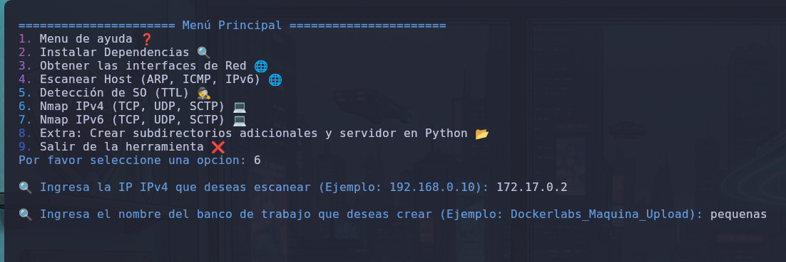
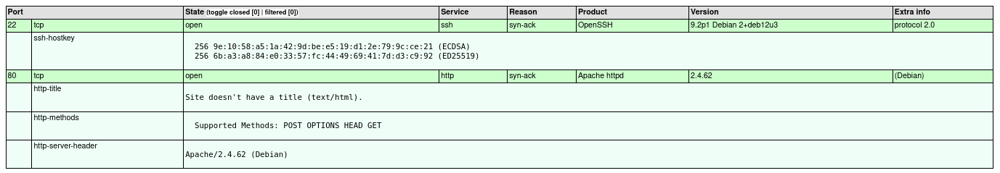
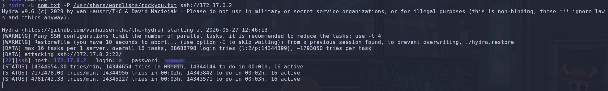
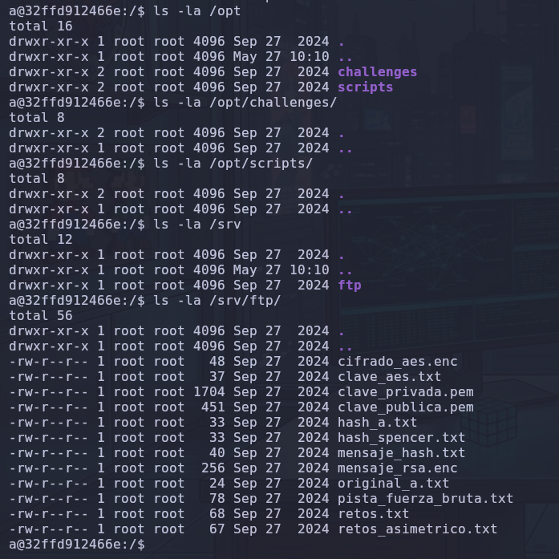
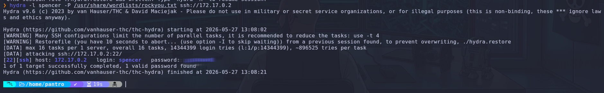
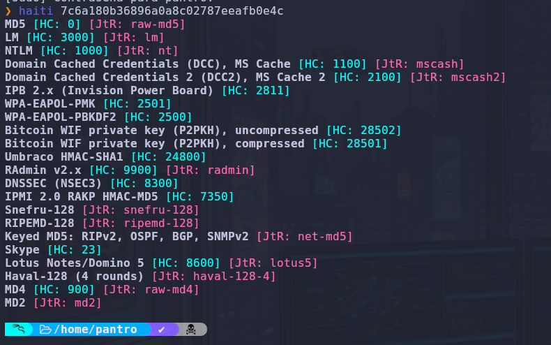
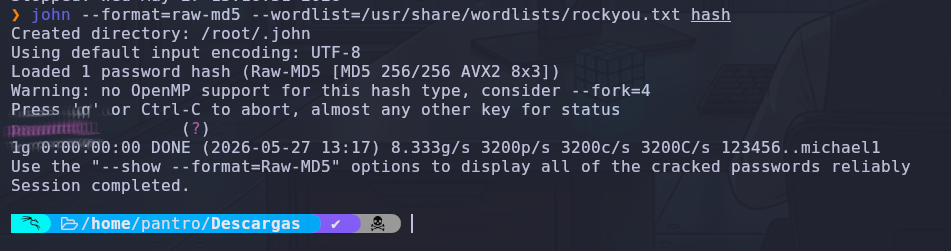
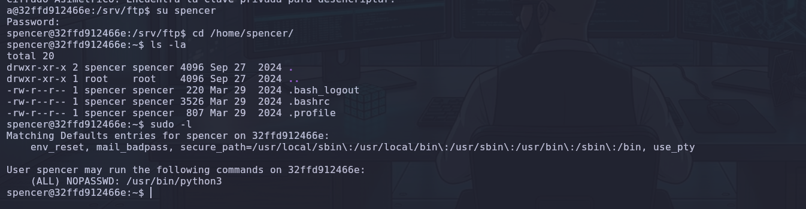
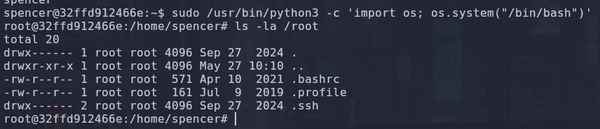

# 🚀 Write-Up: Infiltración en "Pequeñas Mentirosas" (DockerLabs)

## 📌 1. Fase de Reconocimiento (NDiscover)

Para esta etapa inicial, utilizamos **NDiscover** de _MatthyGD_ ([disponible en GitHub](https://www.google.com/search?q=https://github.com/MatthyGD/NDiscover)), una herramienta esencial para la fase de reconocimiento que automatiza la creación de una estructura de carpetas organizada y levanta un servidor local para visualizar los informes HTML que genera automáticamente.

### 💻 Comando Ejecutado:


```Bash
# Escaneo de puertos y servicios con NDiscover
ndiscover -t 172.17.0.2
```

- **Explicación:** Este comando realiza un escaneo de puertos (TCP/UDP/SCTP) y descubrimiento de hosts. Su utilidad radica en que, tras detectar los servicios, genera un reporte estructurado y un servidor web local, permitiéndonos trabajar de forma ordenada desde el primer minuto.
- 


## 🔍 2. Enumeración Web

Tras identificar el servicio HTTP, realizamos una enumeración exhaustiva de directorios para encontrar la "clave para A".

### 💻 Comandos Ejecutados:


```Bash
# Fuzzing con FFUF
ffuf -w /usr/share/wordlists/seclists/Discovery/Web-Content/combined_directories.txt:FUZZ -u http://172.17.0.2/FUZZ -t 300 -mc 200,301

# Enumeración con Gobuster
gobuster dir -u http://172.17.0.2/ -w /usr/share/wordlists/dirbuster/directory-list-2.3-medium.txt -x txt,php,html
```

- **Variables:** * `-w`: Especifica el diccionario de fuerza bruta.
    
    - `-t`: Define el número de hilos de ejecución (300 para velocidad).
        
    - `-mc`: Define los códigos de estado HTTP que consideramos "éxito" (200, 301).
        
    - `-x`: Extensiones de archivo a probar.
        
- **Resultado:** No se hallaron rutas web, por lo que pivotamos nuestra investigación hacia otros vectores.


## 🔐 3. Acceso Inicial (Usuario: `a`)

Dado que la pista mencionaba "la clave para A", inferimos que "A" podría ser un usuario del sistema. Creamos un diccionario personalizado (`nom.txt`) que contiene "a" y "A" para cubrir variaciones de nombre de usuario.

### 💻 Comando Ejecutado:


```Bash
hydra -L nom.txt -P /usr/share/wordlists/rockyou.txt ssh://172.17.0.2
```

- **Explicación:** `hydra` es una herramienta de fuerza bruta multihilo. Usamos `-L` para cargar nuestra lista de usuarios (donde incluimos 'a' y 'A' para asegurar que el sistema no distinga entre mayúsculas/minúsculas en el login) y `-P` para cargar el diccionario _rockyou.txt_.

- **Resultado:** Obtenemos la contraseña para el usuario `a`.


## 📂 4. Enumeración Interna y Exfiltración

Antes de lanzarnos a buscar archivos, establecimos una línea base de seguridad. Verificamos si existían binarios SUID, _Capabilities_ (con `getcap`) o permisos `sudo` para el usuario `a`. Tras descartar estas vías, realizamos una búsqueda profunda de directorios en el sistema (`/var`, `/opt`, `/tmp`, `/srv`).

### 💻 Hallazgos:

En `/srv/ftp/` encontramos archivos críticos que daban paso a nuevos vectores:


```Bash
ls -la /srv/ftp/
```

_(Se encontraron archivos como `clave_aes.txt`, `hash_a.txt`, `hash_spencer.txt` y varios archivos cifrados)._


## 🔓 5. Movimiento Lateral (Usuario: `spencer`)

Al analizar el contenido de `/srv/ftp/`, identificamos dos caminos para escalar al siguiente usuario:

### Camino 1: Fuerza Bruta SSH

Directamente sobre el servicio, probamos credenciales para el usuario `spencer`.


```Bash
hydra -l spencer -P /usr/share/wordlists/rockyou.txt ssh://172.17.0.2
```

- **Explicación:** Al ser un servicio expuesto y con una política de contraseñas posiblemente débil, el ataque de diccionario sobre SSH es una vía estándar.


### Camino 2: Criptoanálisis de Hashes

Descifrado de archivos de identidad encontrados en el FTP.


```Bash
# Identificación del hash
haiti 7c6a180b36896a0a8c02787eeafb0e4c

# Cracking con John the Ripper
john --format=raw-md5 --wordlist=/usr/share/wordlists/rockyou.txt hash_spencer.txt
```

- **Explicación:** Identificamos el hash como MD5 mediante `haiti` y utilizamos `john` con la _wordlist_ _rockyou.txt_ para obtener la contraseña en texto plano, validando el mismo resultado que en el Camino 1.



## 👑 6. Escalada de Privilegios (Root)

Ya como `spencer`, enumeramos nuevamente los privilegios.

### 💻 Comando Ejecutado:


```Bash
sudo -l
```

- **Resultado:** `(ALL) NOPASSWD: /usr/bin/python3`.

- **Explicación:** Esto permite ejecutar Python con privilegios de root sin contraseña, una vulnerabilidad crítica que permite invocar una terminal interactiva del sistema.



### 💻 Comando Ejecutado (Explotación):


```Bash
sudo /usr/bin/python3 -c 'import os; os.system("/bin/bash")'
```

- **Resultado:** Obtenemos una shell con UID 0 (root), logrando el control total del contenedor.

