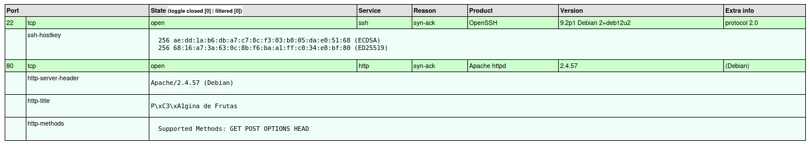
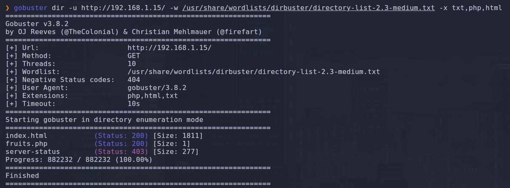
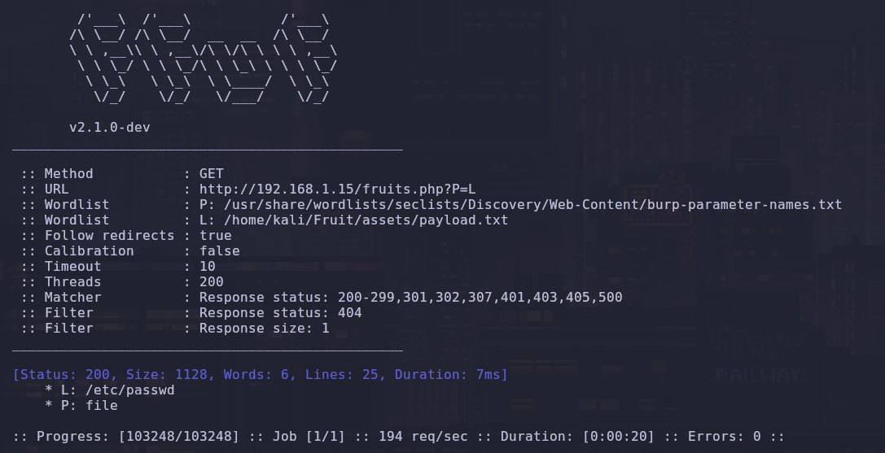
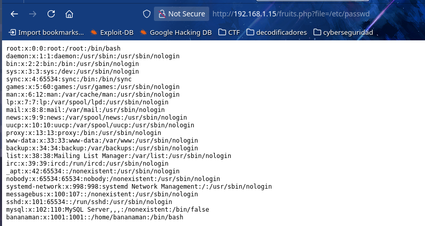
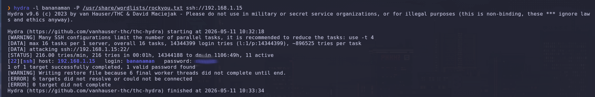
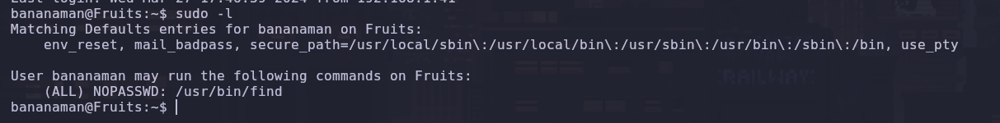
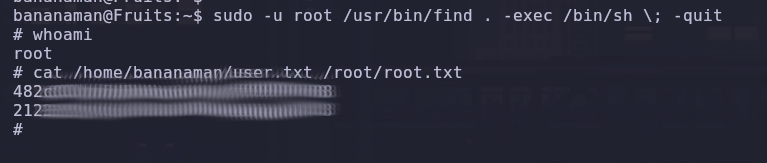

# 🍎 Fruit

**Por PanTrO**

¡Hola a todos! Os traigo el write-up de una máquina que me ha divertido mucho. No es la más difícil del mundo, pero tiene unos puntos de enumeración web muy finos y una escalada de privilegios clásica que siempre viene bien recordar. ¡Vamos a lío!

---

## Fase 1: Reconocimiento. Oteando el horizonte.

Lo primero de lo primero, una vez que tuve la IP de la víctima (`192.168.1.15`), fue lanzar un escaneo para ver qué puertas estaban abiertas.

Para esto, usé mi comando de `nmap` de cabecera. Sé que es un poco largo, pero me encanta porque me genera un informe HTML automático que queda súper profesional para el informe final y es mucho más amigable de leer que el texto plano de la terminal. Además, como soy un impaciente, uso `--stats-every=5s` para que me vaya diciendo cómo va cada poco tiempo.

El comando completo fue este:


```Bash
nmap --stats-every=5s -p 0-65535 --open --min-rate=5000 -T5 -A -sT -Pn -n -v 192.168.1.15 -oX nmap_TCP.xml && xsltproc nmap_TCP.xml -o nmap_TCP.html && open nmap_TCP.html &>/dev/null & disown
```

_(Aquí explico rápido los _flags_ principales: `-p 0-65535` para escanear _todos_ los puertos, `--open` para que solo me muestre los activos, `-A` para detección agresiva de SO y versiones, y `T5` para que vaya a toda leche)._

**Resultados del Nmap (¡Mirad qué bonito queda el informe!):**



Como veis en la captura, el escaneo nos dio dos puntos de entrada:

1. **Puerto 22 (SSH):** Un OpenSSH 9.2p1 bastante actualizado. No parece que vaya a haber un exploit público fácil para esto.
    
2. **Puerto 80 (HTTP):** Un servidor Apache. ¡Aquí es donde suele estar la fiesta!
    

---

## Fase 2: Enumeración Web. 

Me metí en la web y... decepción. Solo había una imagen de fondo y un buscador que, al usarlo, me daba un error 404. Revisé el código fuente y nada, todo limpio. Estaba claro que la página ocultaba algo.

Necesitaba descubrir directorios ocultos, así que lancé `gobuster` y `ffuf`. El primero me dio una pista clave: un archivo llamado `fruit.php`.



Fui corriendo a visitarlo, pero la página estaba en blanco. Lo sospechoso era que tenía un `size = 1`. ¡1 byte! Eso es la señal clásica en CTFs de que el archivo PHP está esperando un parámetro (una variable en la URL) para hacer algo, pero si no se lo das, se queda mudo. Pensé inmediatamente en un ataque **LFI (Local File Inclusion)**.

Para romper este PHP mudo, usé una técnica que me gusta mucho: el "fuzzing combinatorio" con `ffuf`. Es un comando avanzado que prueba nombres de parámetros y payloads de LFI a la vez.

Me bajé el diccionario de payloads LFI de la biblia del pentesting, `PayloadsAllTheThings`, y usé este comando:


```Bash
ffuf -c -t 200 -r -fc 404 -w "burp-parameter-names.txt:P" -w "payloads.txt:L" -u "http://192.168.1.15/fruits.php?P=L" -fs 1
```

_(Usé `-fs 1` para filtrar todas las respuestas vacías de 1 byte y quedarme solo con las que de verdad estaban cargando algo)._

¡Y funcionó! El `ffuf` encontró el parámetro `file`. Probé la ruta clásica en el navegador: `http://192.168.1.15/fruits.php?file=/etc/passwd` y... ¡BINGO!



Ahí lo tenéis. No solo confirmamos LFI, sino que encontramos un usuario con bash: **bananaman (UID 1001)**. Ya teníamos nombre, ahora necesitábamos la contraseña.


---

## Fase 3: Intrusión. Rompiendo la cerradura SSH.

Ya que teníamos el usuario y el puerto 22 (SSH) estaba abierto, la siguiente jugada era obvia: ataque de fuerza bruta. No hay por qué complicarse si la puerta es débil.

Saqué mi martillo pilón favorito, `hydra`, y el diccionario `rockyou.txt`:


```Bash
hydra -l bananaman -P /usr/share/wordlists/rockyou.txt ssh://192.168.1.15
```

No hubo que esperar mucho. En unos minutos, `hydra` encontró la contraseña de `bananaman`. ¡Estábamos dentro!


---

## Fase 4: Escalada de Privilegios. Coronándonos root.

Ya con una TTY real vía SSH como `bananaman`, tocaba el asalto final. El objetivo: ser `root`.

Lo primero que pruebo _siempre_ en estos casos es `sudo -l`. Es el comando que te dice qué puedes ejecutar como superusuario sin saber la contraseña. Y la suerte estuvo de mi lado:



Como veis, `bananaman` podía ejecutar `/usr/bin/find` como root sin contraseña (`NOPASSWD`). Esto es un error de configuración de manual y la clave de la escalada.

Me fui directo al viejo y confiable portal **GTFOBins** (que si no lo conocéis, ya estáis tardando). Busqué `find`, vi que tiene un parámetro `-exec` que permite ejecutar comandos del sistema, y usé este comando para elevar mis privilegios:


```Bash
sudo -u root /usr/bin/find . -exec /bin/sh \; -quit
```

¡Dicho y hecho! La terminal cambió de `$` a `#`. Éramos **root**.

---

## Fase 5: Flags y Cierre. Recogiendo el botín.

Con control absoluto del sistema, solo quedaba hacer un `cat` a las banderas para terminar la misión:

Bash

```
cat /home/bananaman/user.txt /root/root.txt
```



¡Y eso es todo! Una máquina genial para practicar LFI y recordar que una mala configuración de `sudo` puede ser el fin de tu servidor. ¡Espero que os haya gustado el write-up!