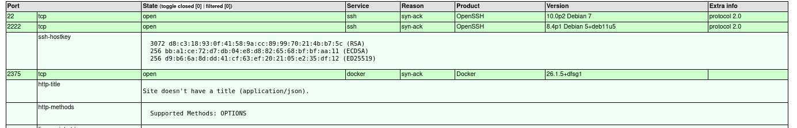
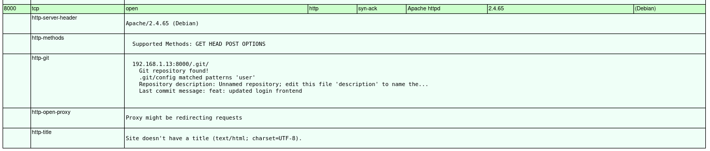
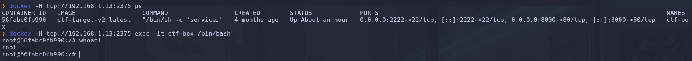
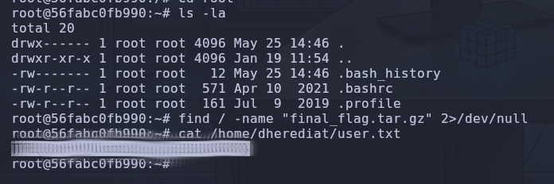
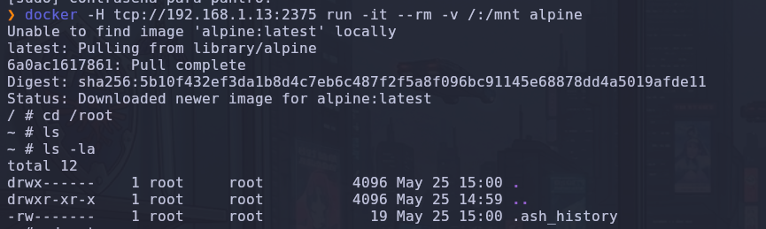
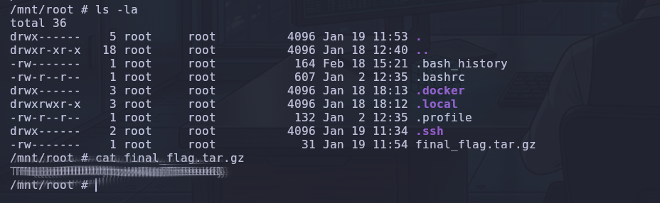

# 🌐 Out of Band

**Por PanTrO**

¡Nueva máquina comprometida y añadida a la colección! En esta oportunidad nos enfrentamos a **Out of Band**, un laboratorio excelente que pone de manifiesto el peligro extremo de exponer APIs de gestión de infraestructura hacia la red interna sin una correcta autenticación y los riesgos asociados a la exposición de directorios de desarrollo. A continuación, se detalla el proceso completo de intrusión y toma de control absoluta del sistema host.

## Fase 1: Reconocimiento. Escaneando los puertos expuestos.

El despliegue táctico comenzó con un escaneo agresivo sobre el total del rango TCP, buscando identificar de manera precisa todos los servicios activos, sus versiones y posibles vectores de entrada:


```Bash
nmap --stats-every=5s -p 0-65535 --open --min-rate=5000 -T5 -A -sT -Pn -n -v 192.168.1.13 -oX nmap_TCP.xml && xsltproc nmap_TCP.xml -o nmap_TCP.html
```

### 📊 Puertos Abiertos Detectados:

- **`22/tcp` (SSH):** OpenSSH 10.0p2 Debian 7 (Protocolo 2.0).

- **`2222/tcp` (SSH Secundario):** OpenSSH 8.4p1 Debian. La presencia de una doble instancia de SSH es un claro indicativo perimetral de reenvío de puertos o entornos dockerizados.

- **`2375/tcp` (Docker API):** Docker Engine API v26.1.5. Puerto crítico expuesto en red sin cifrado TLS ni mecanismos de autenticación.

- **`8000/tcp` (HTTP):** Apache httpd 2.4.65 ((Debian)). Servidor web principal que aloja la aplicación del objetivo.




## Fase 2: Enumeración Web y Fuzzing de Directorios

Al inspeccionar el servicio web en el puerto `8000`, se visualizó un panel de autenticación interactivo gestionado por `index.php`. Con el fin de descubrir rutas ocultas y archivos residuales en el servidor, se procedió a realizar un fuzzing de directorios exhaustivo utilizando **ffuf**:
![[web.png]]

```bash
ffuf -w /usr/share/wordlists/seclists/Discovery/Web-Content/combined_directories.txt:FUZZ -u http://192.168.1.13:8000/FUZZ -t 300 -mc 200,301
```

### 📂 Estructura Crítica Localizada:

El escaneo reportó una vulnerabilidad de exposición de información crítica: **toda la estructura del sistema de control de versiones `.git` se encontraba expuesta de forma pública**:

- `.git/config` [Status: 200]

- `.git/index` [Status: 200]

- `.git/logs/` [Status: 200]


## Fase 3: Análisis Forense. Destripando los secretos de Git.

Al extraer y analizar los metadatos y artefactos contenidos en la carpeta oculta `.git`, se realizó una reconstrucción del histórico de desarrollo del sitio:

1. **`.git/config`**: Reveló las directivas operacionales del entorno, identificando que el pipeline está automatizado por la cuenta `DevOps Bot <ci-cd@internal.corp>`.

2. **`.git/index`**: El análisis del área de preparación evidenció la presencia histórica de un archivo denominado `deploy_key.pub`, confirmando una fuga de llaves criptográficas (_Secret Leakage_).

3. **`.git/logs/HEAD` (Reflog)**: El estudio del historial profundo de referencias expuso que el bot de CI/CD había integrado unas llaves de despliegue privadas y posteriormente intentó mitigar el error mediante un commit de reversión (`revert: removed sensitive keys`).


**Conclusión Forense:** Debido a la naturaleza de Git, la reversión de un commit no elimina físicamente los objetos del historial. El hash original (`deb0ff42cbd190b8296f00921b002c537c34667e`) permanecía accesible de manera huérfana en la base de datos de objetos del repositorio, permitiendo la reconstrucción completa de los archivos comprometidos mediante herramientas de extracción offline.


## Fase 4: Acceso Inicial. Control del Contenedor Web.

En paralelo al vector del código fuente, el puerto **2375** detectado en el reconocimiento inicial ofrecía una vía de explotación directa. Al interactuar con la API remota de Docker, se listaron los componentes activos del host:


```Bash
docker -H tcp://192.168.1.13:2375 ps
```

El sistema reportó la ejecución de un contenedor llamado `ctf-box` (ID: `56fabc0fb990`) bajo la imagen `ctf-target-v2:latest`. Dicho contenedor mapeaba hacia el host el puerto 80 (como puerto 8000) y el puerto 22 (como puerto 2222).

Aprovechando la falta de autenticación de la API, se ejecutó una sesión interactiva directa contra el contenedor en producción:


```bash
docker -H tcp://192.168.1.13:2375 exec -it ctf-box /bin/bash
```



Una vez consolidado el acceso al entorno virtualizado, se estabilizó la shell y se exploró el sistema de archivos, localizando y capturando con éxito la primera bandera del reto en el directorio personal del usuario de la aplicación (`user.txt`).



## Fase 5: Escalada de Privilegios. Escape Total de Contenedor hacia el Host.

Puesto que el contenedor actual se encontraba aislado mediante _namespaces_, la bandera de administración máxima (`root`) residía fuera del entorno web, en el almacenamiento físico de la máquina base (`192.168.1.13`).

Para comprometer el host real, se utilizó la API expuesta del demonio para desplegar un contenedor interactivo efímero basado en `alpine`, aplicando una técnica de **montaje de volúmenes arbitrarios**. Mediante el parámetro `-v`, se mapeó el directorio raíz completo del servidor real (`/`) dentro de la carpeta `/mnt` del nuevo contenedor:


```bash
docker -H tcp://192.168.1.13:2375 run -it --rm -v /:/mnt alpine
```



Al completarse el despliegue, el aislamiento del contenedor quedó anulado de manera absoluta, otorgando visibilidad completa sobre los datos confidenciales del servidor real. Se navegó hacia el directorio del administrador del host físico (mapeado en `/mnt/root`) para obtener el archivo definitivo:


```Bash
cd /mnt/root
ls -la
cat final_flag.tar.gz
```

¡Máquina comprometida en su totalidad con privilegios máximos de Root!



## 🛡️ Recomendaciones de Mitigación y Hardening

1. **Aislamiento y Securización de la API de Docker:** El puerto de gestión de Docker (2375) nunca debe ser accesible a través de interfaces de red públicas o compartidas sin protección. Se debe configurar el demonio para escuchar exclusivamente en local (`127.0.0.1`) o, en caso de requerir administración remota, implementar obligatoriamente autenticación mutua TLS mediante certificados digitales, migrando el servicio al puerto seguro `2376`.

2. **Restricción de Acceso a Directorios de Configuración:** Configurar las reglas del servidor web Apache (a través de los archivos de configuración del sitio o `.htaccess`) para denegar de forma estricta cualquier petición web dirigida a carpetas ocultas o sistemas de control de versiones:

```Apache
RedirectMatch 404 /\.(git|config|index|logs)
```

3. **Saneamiento e Higienización del Historial de Git:** Al detectarse la subida accidental de llaves o credenciales, no es suficiente con aplicar un `git rm` o `git revert`. Es imperativo purgar físicamente los hashes del histórico de objetos del repositorio utilizando utilidades de limpieza profunda como `git filter-repo` o `BFG Repo-Cleaner` para evitar su posterior reconstrucción forense.